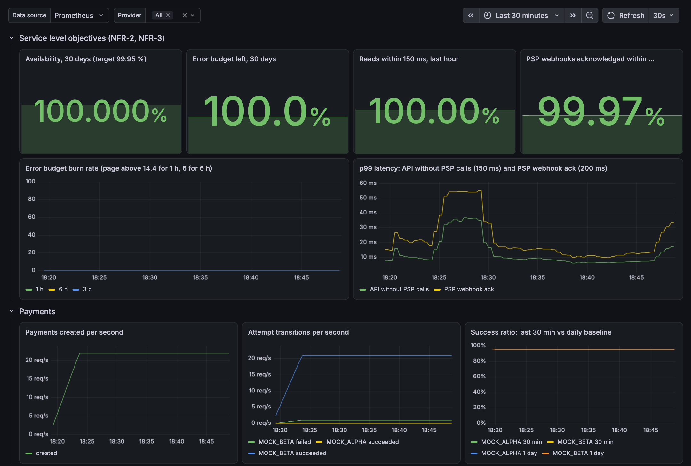
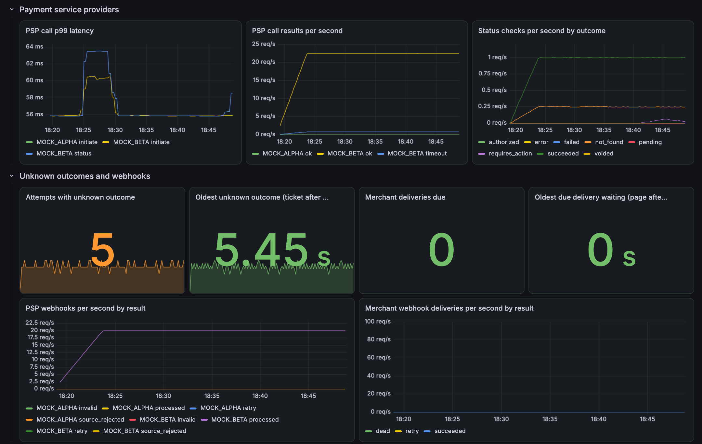
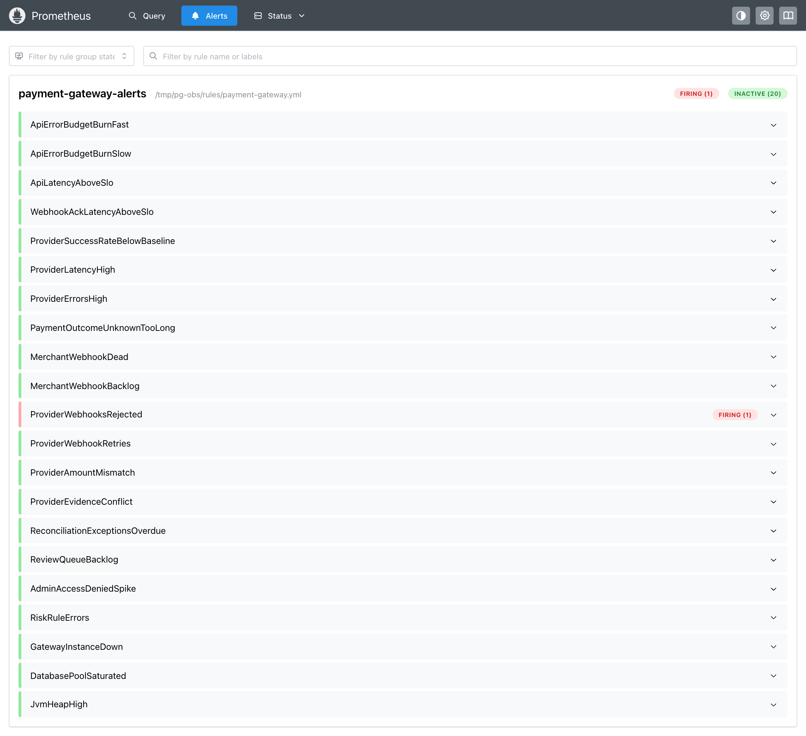
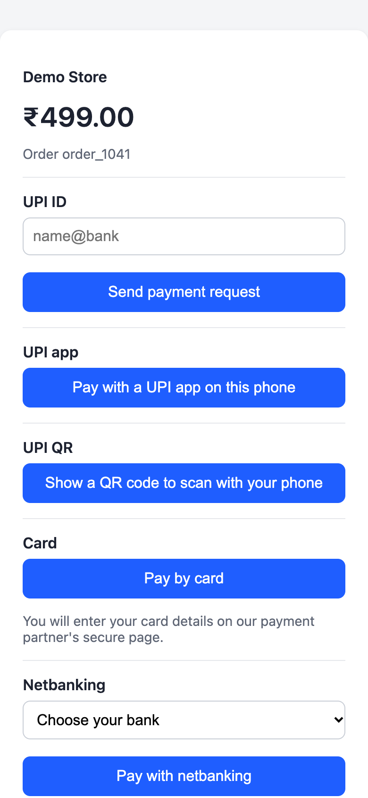
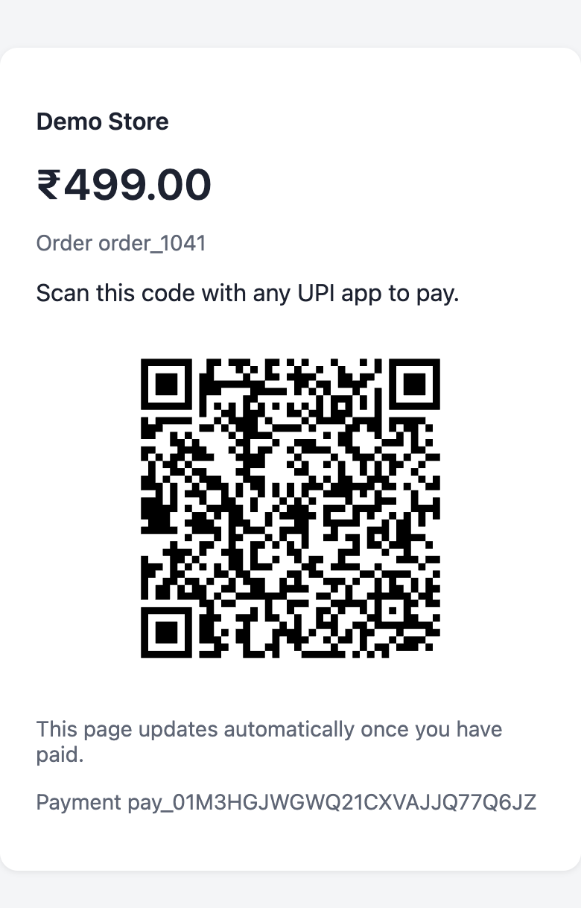
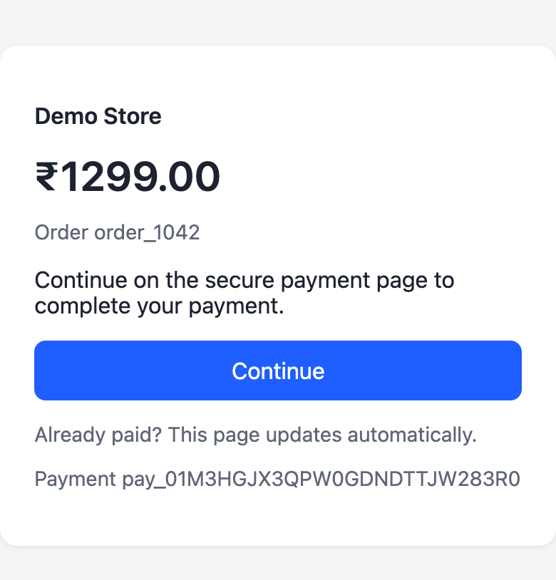
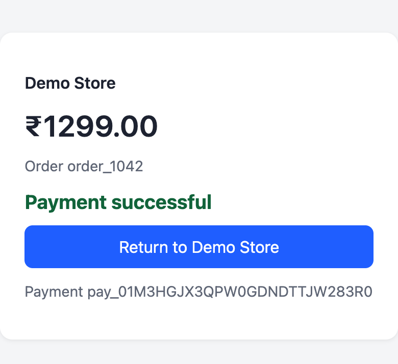
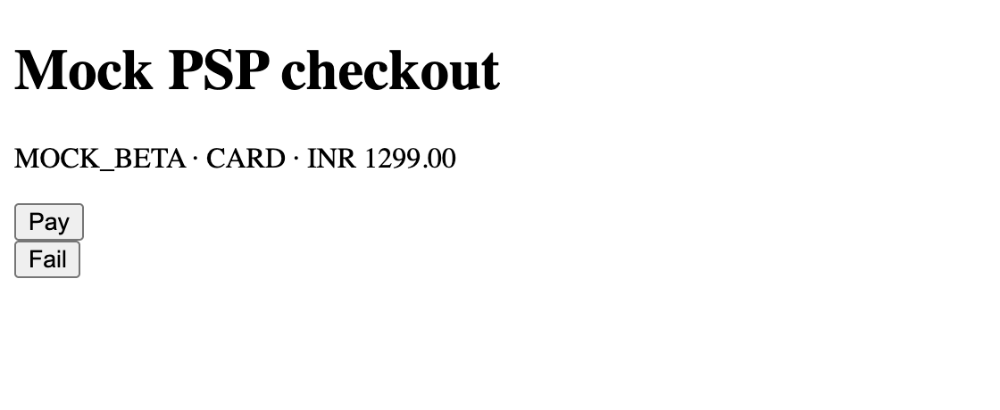
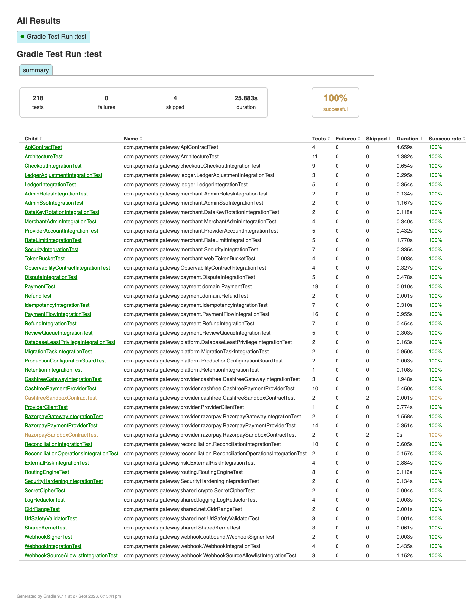

# Payment Gateway

A payment gateway reference implementation built around a multi-PSP orchestrator. It is designed for India first (UPI, cards, netbanking) and built to commercial engineering standards: explicit state machines, layered idempotency, unknown-outcome handling, a transactional outbox, signed webhooks, and routing based on PSP capabilities and health.

> Status: every roadmap phase (1–17) is built and tested; what is left needs PSP sandbox keys or an AWS account (below). V2 has started: phase 18, recurring payments (UPI AutoPay, card and eNACH mandates), is built and tested. V1 includes:
> - the double-entry shadow ledger and PSP reconciliation, with exception SLAs and a daily report;
> - chargebacks and UPI disputes;
> - the risk engine, with an external fraud connector and a manual review queue;
> - admin roles;
> - API hardening: an OpenAPI contract enforced by tests, per-merchant rate limits (with overrides) and a hosted checkout with UPI QR;
> - security hardening (ADR-022 to ADR-026): admin SSO, maker-checker ledger adjustments, data key rotation, and database least privilege; CI fails on fixable HIGH/CRITICAL vulnerabilities in the jar or image (ADR-033);
> - observability (ADR-027): SLO burn-rate alerts, a Grafana dashboard, runbooks, and a local Prometheus/Grafana/Tempo stack ([screenshots](#screenshots)).
>
> Remaining: the Razorpay (ADR-030) and Cashfree (ADR-031) adapters, including their settlement reports for reconciliation (ADR-032), are built and tested against stubs of their APIs, but their sandbox contract tests need PSP test keys. The Terraform is written and tested without AWS but has not been applied to an account, so the 1,000 TPS peak load test still needs that environment. Going live also needs an external security review (penetration test) and legal confirmation of the 8-year retention assumption (NFR-16). See the [Roadmap](#roadmap).
>
> Progress, measured in the [implementation plan](docs/implementation-plan.md#progress): V1 is 96% done (22 of 23 units). With the V2 phases planned there, the whole project is 65% done (25 of 38.5).

## Documentation

| Doc | Contents |
|---|---|
| [docs/requirements.md](docs/requirements.md) | Scope decisions, functional and non-functional requirements, compliance constraints; draft V2 requirements (§8) |
| [docs/architecture.md](docs/architecture.md) | HLD: context, modules, flows (UPI, card, refund, webhooks, reconciliation, failure handling), deployment, DR |
| [docs/low-level-design.md](docs/low-level-design.md) | Domain model, state machines, algorithms, provider SPI, routing, idempotency, schema, API, error codes |
| [docs/openapi.yaml](docs/openapi.yaml) | Merchant API contract (OpenAPI 3.1), including webhook events; `ApiContractTest` keeps the code in line with it |
| [docs/decisions/](docs/decisions/README.md) | ADR-001 … ADR-035 |
| [docs/runbooks.md](docs/runbooks.md) | What to do for every alert: meaning, checks, actions |
| [docs/implementation-plan.md](docs/implementation-plan.md) | V1 close-out and V2 phases 18–28: exit criteria, sizes, and how progress is measured |

## Quick start

JDK 25 is required. Docker is optional.

```bash
# Without Docker: embedded PostgreSQL 17, mock PSPs, workers on, http://localhost:8080
./gradlew bootTestRun

# With Docker
docker compose up --build

# In another terminal: end-to-end demo (onboard → pay via UPI → webhook → refund → timeout recovery)
./scripts/demo.sh

# With dashboards and traces: Grafana http://localhost:3000, Prometheus alerts http://localhost:9090/alerts
OTLP_TRACING_ENABLED=true docker compose --profile observability up --build
```

The `local` profile is for development only. It uses the admin token `local-admin-token`, enables the mock PSPs and simulator, and relaxes the webhook URL policy.

```bash
./gradlew test    # unit, integration (embedded PostgreSQL) and architecture tests
./gradlew build   # compile (-Werror), test, package

# Load test against a running local app (k6; thresholds encode NFR-1/2/3, ADR-029)
k6 run -e PROFILE=smoke -e METRICS_URL=http://localhost:8080/actuator/prometheus load-tests/payment-flow.js
k6 run -e PROFILE=steady -e DURATION=60s load-tests/payment-flow.js   # 100 payments/s
```

## Screenshots

These come from a local run of this repository with the built-in mock PSPs, not from a production system.
- **Stack:** the gateway (`./gradlew bootTestRun`), with Prometheus 3.15 loading the committed alert rules and Grafana 13.2 serving the provisioned dashboard. This is the same configuration as `docker compose --profile observability`.
- **Load:** k6 ran 20 end-to-end payments per second for 32 minutes: 38,400 payments, all succeeded, and none of 153,615 requests failed. Alongside it, 2 payments per second exercised the mock PSPs' edge cases (declines, timeouts, pending and never-submitted payments).
- **Attack:** 15 PSP webhooks with forged signatures were sent at minute 12.

### Grafana dashboard



*Service level objectives and payments.*
- Availability and error budget stay at 100 %, with a flat burn rate.
- p99 latency stays under 60 ms, against the 150 ms (API) and 200 ms (webhook) targets.
- About 22 payments are created per second, and `MOCK_BETA` takes all of them. With no routing rules, the gateway orders PSPs by health score and uses the first one (ADR-009).



*PSPs, unknown outcomes and webhooks.*
- PSP call p99 latency is 56–64 ms; the mocks add 50 ms. The results include the timeouts from the edge cases.
- Status checks resolve those timeouts. The 5 attempts with an unknown outcome are at most 5.45 s old, far below the one-hour ticket threshold.
- No merchant deliveries are waiting.

The other rows (money safety, security, runtime) are in the [runbooks](docs/runbooks.md), next to the alerts they explain.

### Prometheus alerts



*Alert rules at minute 20.* `ProviderWebhooksRejected` is firing because of the forged webhooks; the other 20 alerts are inactive.

### Hosted checkout

<p>
  
  
  
  
</p>

*The customer-facing checkout on a phone (ADR-013).* From left to right: choosing a method, the UPI QR code, handing over to the PSP's page for a card, and the result after the customer comes back.

### Mock PSP test page



*The simulator's stand-in for a PSP-hosted payment page* (local and test profiles only). **Pay** or **Fail** completes the transaction and sends the signed webhook; this is how the card payment above was finished.

### Test report



*Gradle's test report for commit `8c0c199`.* 218 tests, 0 failures. The 4 skipped are the Razorpay and Cashfree sandbox contract tests, which run only with sandbox keys. CI runs the same suite on every push.

## API at a glance

```bash
# Admin: onboard a merchant and issue an API key (both secrets are shown once)
curl -X POST localhost:8080/admin/v1/merchants -H 'Authorization: Bearer local-admin-token' \
  -H 'Content-Type: application/json' -d '{"name":"Store","providers":["MOCK_ALPHA","MOCK_BETA"]}'
curl -X POST localhost:8080/admin/v1/merchants/{merchant_id}/api-keys -H 'Authorization: Bearer local-admin-token'

# Merchant: create, then confirm (every POST needs an Idempotency-Key)
curl -X POST localhost:8080/v1/payments -H "Authorization: Bearer $KEY" -H 'Idempotency-Key: k1' \
  -H 'Content-Type: application/json' -d '{"amount":49900,"currency":"INR","merchant_order_id":"order_1"}'
curl -X POST localhost:8080/v1/payments/{id}/confirm -H "Authorization: Bearer $KEY" -H 'Idempotency-Key: k2' \
  -H 'Content-Type: application/json' -d '{"payment_method":{"type":"upi","upi":{"flow":"intent"}}}'

# Or let the hosted checkout collect the method: open the returned "url" in a browser
curl -X POST localhost:8080/v1/checkout-sessions -H "Authorization: Bearer $KEY" -H 'Idempotency-Key: k3' \
  -H 'Content-Type: application/json' -d '{"payment_id":"{id}","return_url":"https://merchant.example/orders/1"}'
```

| Endpoint | Purpose |
|---|---|
| `POST /v1/payments` · `GET /v1/payments/{id}` | Create / retrieve |
| `POST /v1/payments/{id}/confirm` · `/capture` · `/cancel` | Start an attempt / capture an authorization / cancel or void |
| `POST /v1/payments/{id}/refunds` · `GET /v1/payments/{id}/refunds` · `GET /v1/refunds/{id}` | Refunds |
| `GET /v1/payments/{id}/disputes` · `GET /v1/disputes/{id}` | Chargebacks and UPI disputes reported by the PSP (read-only; `dispute.*` webhooks) |
| `POST /v1/mandates` · `GET /v1/mandates/{id}` · `POST /v1/mandates/{id}/revoke` | Recurring payments: register a UPI AutoPay, card or eNACH mandate (the customer authorizes it at the PSP), follow `mandate.*` webhooks, revoke (ADR-035) |
| `POST /v1/mandates/{id}/debits` · `GET …/debits[/{debit_id}]` · `POST …/debits/{debit_id}/cancel` | Debit an active mandate: the gateway notifies the customer at least 24 h ahead (UPI, card), executes, and retries up to 3 times a day apart; each debit is a payment with `payment.*` webhooks |
| `POST /v1/checkout-sessions` · `GET/POST /checkout/{token}` | Hosted checkout session; the customer-facing page (HTML, no JavaScript; UPI app, UPI ID or scannable QR, card, netbanking) |
| `POST /v1/webhooks/providers/{code}/{account_id}` · `POST /v1/webhooks/providers/{code}` | PSP webhooks for a merchant's own PSP account (can only affect that merchant) or with platform-level secrets |
| `/admin/v1/merchants` · `/routing-rules` · `/providers/health` · `/webhook-deliveries` | Admin |
| `PATCH /admin/v1/merchants/{id}` · `/suspend` · `/reactivate` · `/webhook-secret` · `/api-keys[/{key_id}/revoke]` | Merchant settings (including `mandate_debit_limit`), suspension, webhook secret rotation (both secrets valid during a grace period), API key rotation and revocation |
| `PUT /admin/v1/merchants/{id}/provider-accounts/{provider}` · `GET …/provider-accounts` · `POST …/{provider}/disable` | Merchant's own PSP accounts: encrypted credentials (shown masked), per-account webhook path |
| `GET /admin/v1/ledger/balances?merchant_id=` · `GET /admin/v1/ledger/transactions?reference_id=` | Shadow ledger balances and postings |
| `POST /admin/v1/ledger/adjustments` · `POST …/{id}/approve` · `/reject` | Manual ledger corrections: one operator requests, a different one approves (maker-checker, ADR-024) |
| `POST /admin/v1/reconciliation/runs` · `GET /admin/v1/reconciliation/exceptions` · `POST …/exceptions/{id}/assign` · `/resolve` · `GET …/reports/daily?date=` | Reconcile a merchant PSP account for a window; work the exception queue (owner, 48 h SLA, overdue filter); daily report per business day |
| `GET /admin/v1/reviews` · `POST /admin/v1/reviews/{attempts\|refunds}/{id}/resolve` | Manual review queue (amount mismatch, PSP conflict, unresolved after 72 h, risk review); audited acknowledgement |
| `/simulator/...` | Mock PSP hosted page, completion, outage simulation, disputes (`…/payments/{ref}/dispute`, `…/disputes/{id}/status`), mandate authorization and the customer's pause, resume or revoke (`…/mandates/{ref}/complete`, `…/mandates/{ref}/status`) and settlement-report anomalies (local and test only) |

Merchant endpoints have per-merchant rate limits, with separate budgets for reads and writes. When a limit is hit, the API answers `429` with `Retry-After`. The request was not processed and its Idempotency-Key was not used up, so it can be retried unchanged. Operators can raise or lower one merchant's budgets with `PUT /admin/v1/merchants/{id}/rate-limits`, and the change applies from that merchant's next request (ADR-020).

Admin callers are named operators with roles (`admin`, `ops`, `finance`, `read_only`). They sign in through the company identity provider (OIDC access tokens whose `roles` claim carries the gateway role, ADR-023) or use tokens configured by SHA-256 under `pg.security.admin-users`. Each admin endpoint requires one permission, and write endpoints without a declared permission are refused (ADR-019). The audit log records the operator's name.

Mock PSP test scenarios are selected by the last two digits of the amount:

| Suffix | Payment scenario |
|---|---|
| `01` | Timeout, but the PSP processed the payment |
| `03` | Issuer decline |
| `04` | Pending, then succeeds without sending a webhook |
| `05` | Timeout, and the PSP never processed the payment |

| Suffix | Refund scenario |
|---|---|
| `07` | Pending |
| `08` | Timeout, but processed |
| `09` | Failed |

| Suffix | Mandate scenario |
|---|---|
| `max_amount` `01` / `05` | Registration times out, processed / never processed (the poller finds it, or fails it as `not_submitted`) |
| debit `amount` `06` | The pre-debit notification is never delivered |
| debit `amount` `01`, `03`, `04`, `05` | As for payments |

## Project layout

```
src/main/java/com/payments/gateway/
  shared/        money, ids, errors, crypto, JSON, request-id + problem-details handling, SSRF guard
  merchant/      merchants, API keys, auth + rate-limit filters (per-merchant overrides), admin roles, admin API
  idempotency/   Idempotency-Key storage and replay
  provider/      SPI (spi/), registry, circuit-breaking client, health tracker, mock PSPs (mock/),
                 Razorpay and Cashfree adapters with their settlement reports (razorpay/, cashfree/)
  routing/       rules (DB), strategies, routing engine, admin API
  risk/          risk engine, rules and the optional external fraud connector
  payment/       domain (state machines, refunds, disputes), application (orchestration, outcomes, refunds, disputes,
                 resolver, expiry, review queue), infrastructure (JDBC), api (DTOs/mapper), web (controllers)
  webhook/       inbound PSP inbox, outbound merchant outbox + delivery worker
  ledger/        double-entry shadow ledger (postings on capture/refund/fee/chargeback/settlement), admin API
  reconciliation/ settlement-report matching (incl. chargebacks and PSP adjustments), auto-heal, exception queue with owner and SLA,
                 daily report, admin API
  checkout/      hosted checkout sessions and server-rendered pages (UPI QR as inline SVG)
  platform/      worker scheduler (incl. daily T+1 reconciliation at 02:30 IST)
src/main/resources/db/migration/   Flyway schema
src/test/java/...                  unit, integration and ArchUnit tests + LocalDevApplication
deploy/                            database role bootstrap, observability stack (rules, dashboard, collector)
infra/terraform/                   AWS: modules (network, kms, waf, aurora, ecs-service, observability, region), environments/prod
```

## Deploying to AWS

The AWS reference deployment is Terraform ([ADR-028](docs/decisions/ADR-028-terraform-aws.md)): Mumbai primary, Hyderabad warm standby, one `region` module used for both.

```bash
cd infra/terraform/environments/prod
cp backend.hcl.example backend.hcl && cp terraform.tfvars.example terraform.tfvars   # fill in both
terraform init -backend-config=backend.hcl
terraform apply

# No AWS account needed: every module has tests against mocked providers
for d in ../../modules/* .; do terraform -chdir=$d init -backend=false >/dev/null && terraform -chdir=$d test; done
```

First deploy, in this order (see `terraform output`):
1. Run `deploy/db/roles.sql` with the RDS-managed master secret.
2. Store the data keys as `SPRING_APPLICATION_JSON` in the `app-config` secret.
3. Run the migration task.
4. Subscribe the paging tool and ticket queue to the alert topics.
5. Give each PSP the NAT egress IPs.

Region failover is a [runbook](docs/runbooks.md#region-failover).

## Roadmap

| Phase | Scope | Status |
|---|---|---|
| 1–5 | Discovery, requirements, HLD, LLD, ADRs | Done |
| 6 | Scaffolding: Gradle, Docker, CI, Flyway | Done |
| 7 | Payment domain, state machines, idempotency, payment API | Done |
| 8 | Provider SPI, mock PSPs, simulator | Done |
| 9 | Routing engine (rules + health + circuit breakers) | Done |
| 11–12 | Webhooks (inbound inbox, outbound outbox), refunds, status resolver, expiry | Done |
| 10 | Real PSP adapters: Razorpay (ADR-030) and Cashfree (ADR-031) — hosted Payment Links, S2S UPI behind a flag, refunds, disputes, signed per-account webhooks, timeout recovery by our ids, environment and URL guards; settlement reports for reconciliation (ADR-032); stub and gated sandbox contract tests | Done (sandbox runs need keys) |
| 13 | Reconciliation + shadow double-entry ledger | Done |
| — | API hardening: OpenAPI contract + drift test, per-merchant rate limits, minimal hosted checkout | Done |
| — | Merchant management: settings, suspension, API key and webhook secret rotation, encrypted per-merchant PSP credentials, account-scoped PSP webhooks | Done |
| 14 | Risk: external provider connector, decisions stored per attempt, manual review queue (ADR-016) | Done |
| — | Operations and disputes: reconciliation exception owner, SLA and daily report (ADR-017); chargebacks and UPI disputes with ledger impact and refund guard (ADR-018) | Done |
| — | Admin roles: named operators, role permissions, deny-by-default enforcement (ADR-019) | Done |
| — | Per-merchant rate-limit overrides (ADR-020); UPI QR on the hosted checkout (ADR-021) | Done |
| — | Security hardening: headers, body limits, log redaction, production guard, PSP webhook source allowlist (ADR-022); admin SSO (ADR-023); maker-checker ledger adjustments (ADR-024); data key rotation (ADR-025); database least privilege and verified TLS (ADR-026); vulnerability gates on the jar and image (ADR-033) | Done |
| 15 | Observability: SLO burn-rate alerts, dashboard, runbooks, OTel collector and Tempo in compose, promtool tests (ADR-027) | Done |
| 16 | Terraform: two regions from one module, WAF, TLS 1.3, Aurora Global Database, least-privilege IAM, ephemeral secrets; mocked `terraform test`, Trivy in CI (ADR-028) | Done (not yet applied to an account) |
| 17 | Load tests (k6): smoke in CI, steady, peak 1,000/s, spike; thresholds from NFR-1/2/3 (ADR-029). Local baseline: 100 payments/s with zero errors and p99 create 20 ms | Done (peak run needs AWS) |
| 18 | Recurring payments (ADR-035): UPI AutoPay, card and eNACH mandates; debits scheduled by the gateway with a pre-debit notification per cycle, retries and revocation; NFR-19 rules in the database; mock PSP scenarios and the Razorpay adapter (behind `pg.providers.razorpay.mandates`) | Done (sandbox run needs keys) |

**Next: V2, phases 19–28**, accepted in [ADR-034](docs/decisions/ADR-034-post-v1-scope.md):
- partial capture;
- wallets, EMI and pay later;
- bank transfers;
- dispute evidence;
- international cards;
- cost-aware routing;
- merchant billing;
- Payment Aggregator mode: onboarding, escrow and settlement, payouts.

The [implementation plan](docs/implementation-plan.md) gives each phase's exit criteria and size, and measures progress.
