# Architecture (HLD) — Payment Gateway V1

| | |
|---|---|
| Phase | 3 — High-level design |
| Status | Approved baseline (2026-09-26) |
| Inputs | [requirements.md](requirements.md) |
| Details | [low-level-design.md](low-level-design.md), [decisions/](decisions/README.md) |

---

## 1. At a glance

| Concern | Choice | ADR |
|---|---|---|
| Style | **Modular monolith**, one deployable image with two runtime roles: `api` and `worker` | [ADR-001](decisions/ADR-001-modular-monolith.md) |
| Runtime | Java 25, Spring Boot 4.1 (Spring MVC on virtual threads) | [ADR-002](decisions/ADR-002-java-spring-boot.md) |
| System of record | PostgreSQL 17 (Aurora PostgreSQL in AWS), plain JDBC | [ADR-003](decisions/ADR-003-postgresql-jdbc.md) |
| Async processing | No broker in V1: transactional outbox tables + state-driven workers using `SKIP LOCKED` | [ADR-004](decisions/ADR-004-no-broker-v1.md) |
| PSP integration | Capability-based adapter SPI with failure classification | [ADR-005](decisions/ADR-005-provider-adapter-spi.md) |
| Idempotency | DB-backed keys + domain-level idempotency + PSP idempotency keys | [ADR-006](decisions/ADR-006-idempotency.md) |
| Domain model | Separate Payment / Attempt / Refund state machines; Payment is the aggregate root, locked per mutation | [ADR-007](decisions/ADR-007-state-machines.md) |
| Card data | PAN never enters V1; CDE boundary reserved | [ADR-008](decisions/ADR-008-card-data-scope.md) |
| Routing | Declarative rules stored in the DB + in-memory health scoring; no external rule engine | [ADR-009](decisions/ADR-009-routing.md) |
| Cloud | AWS ECS Fargate + Aurora PostgreSQL, Mumbai primary / Hyderabad DR, Terraform | [ADR-010](decisions/ADR-010-aws-deployment.md) |
| Cache | No Redis in V1 | [ADR-011](decisions/ADR-011-no-redis-v1.md) |
| Money flow | Orchestrator with a shadow double-entry ledger | [ADR-012](decisions/ADR-012-orchestrator-shadow-ledger.md) |

## 2. System context

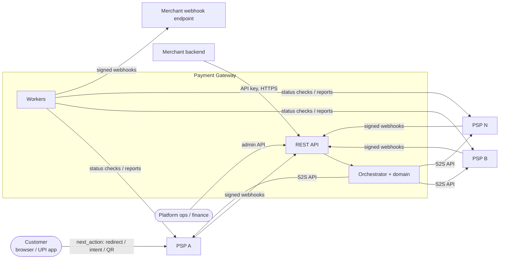

## 3. Logical architecture

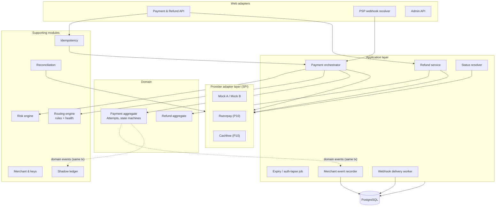

### Module responsibilities

| Module | Owns | Depends on |
|---|---|---|
| `shared` | Money, ids, errors, crypto, request context | — |
| `merchant` | Merchants, API keys, provider accounts, auth filters | shared |
| `idempotency` | Idempotency records, replay | shared |
| `payment` | Payment/Attempt/Refund aggregates, orchestrator, resolver, expiry, payment API | shared, merchant, provider (SPI), routing, risk |
| `provider` | SPI, registry, adapters (mock, later Razorpay/Cashfree), circuit breakers | shared |
| `routing` | Rules, candidate selection, health tracking | shared, provider (SPI) |
| `risk` | Risk rules and decisions | shared |
| `webhook` | Inbound PSP webhook inbox; outbound merchant events and deliveries | shared, payment (events + inbound port), merchant, provider (SPI) |
| `ledger` | Double-entry shadow ledger, balances | shared (listens to `FundsMovement`) |
| `reconciliation` | Settlement-report matching, auto-heal, exception queue | payment (application API), provider (SPI), ledger, merchant |

Dependency rules are checked by ArchUnit tests: domain code has no framework or infrastructure imports, and modules only use each other's public packages.

### Runtime roles

| Role | Enabled by | Does | Scales on |
|---|---|---|---|
| `api` | `pg.workers.enabled=false` | REST API, PSP webhook intake | CPU + request rate |
| `worker` | `pg.workers.enabled=true` | Status resolver, expiry, webhook inbox retries, merchant webhook delivery, daily T+1 reconciliation | Backlog depth |

Both roles use the same image and database. Workers claim work with `FOR UPDATE SKIP LOCKED` plus leases, so any number of replicas is safe.

## 4. Key flows

### 4.1 Create and confirm (generic orchestration)

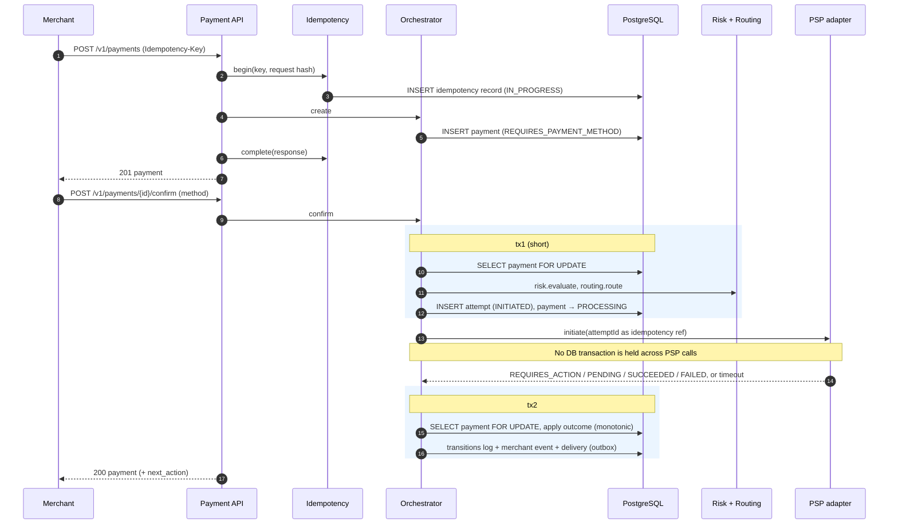

### 4.2 UPI Intent / QR

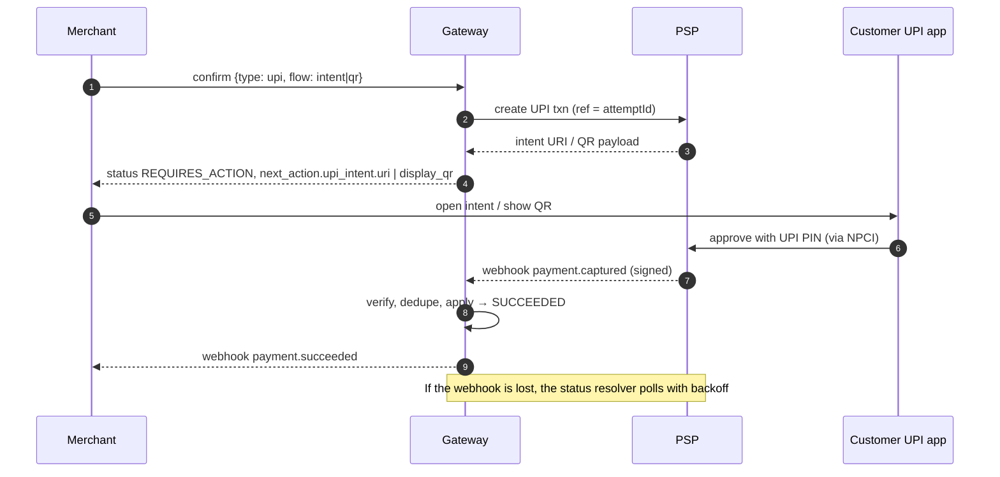

### 4.3 Card (PSP-hosted page, 3DS, manual capture)

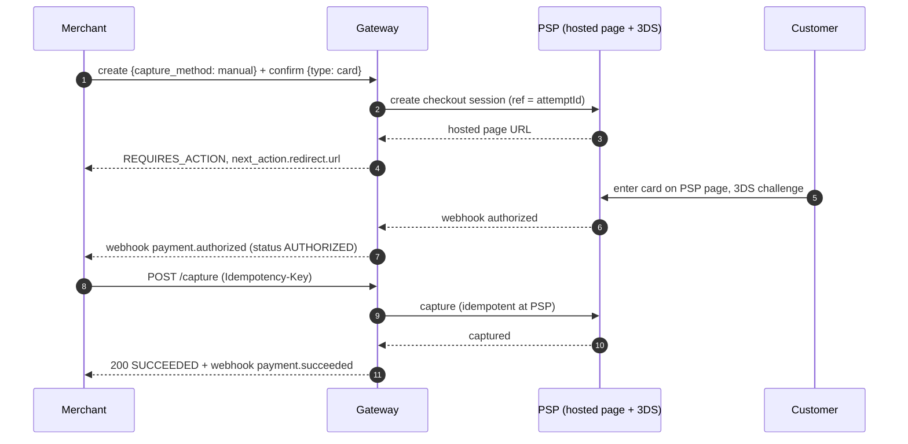

The PAN never reaches the gateway; see [ADR-008](decisions/ADR-008-card-data-scope.md).

### 4.4 Timeout → unknown outcome → resolution

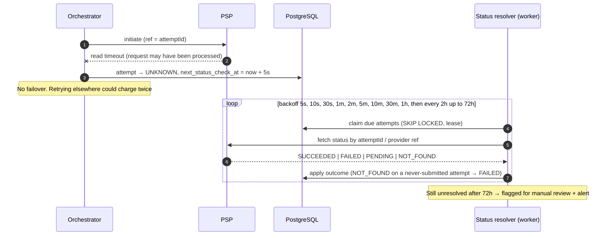

### 4.5 Failover when a provider is unavailable

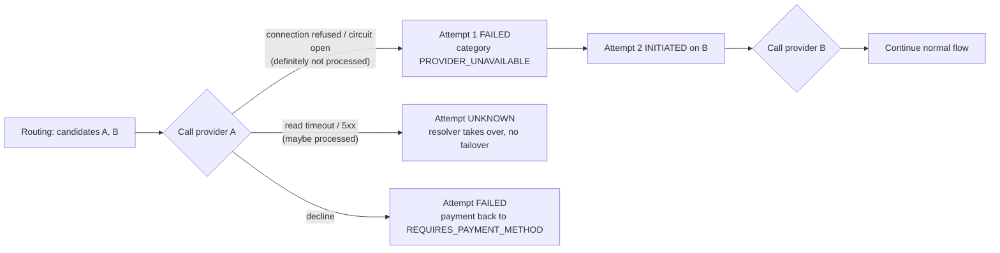

### 4.6 Inbound PSP webhook (inbox pattern)

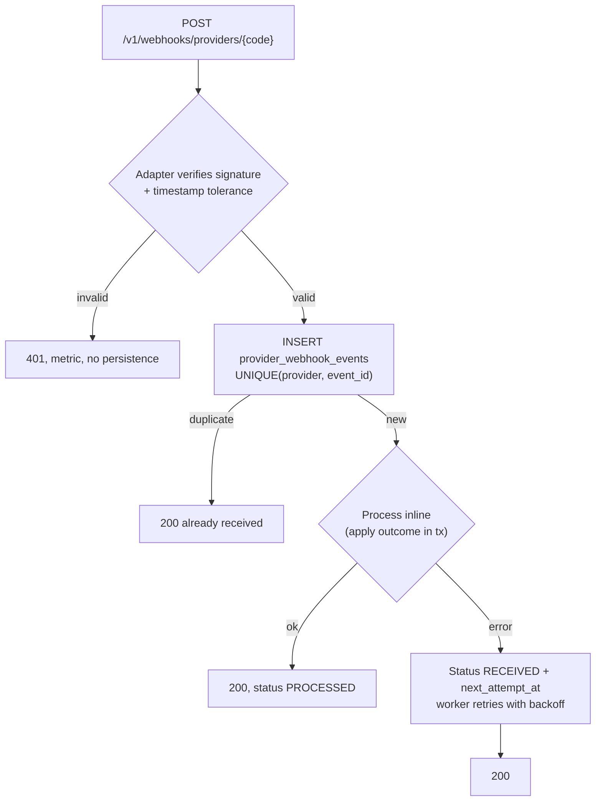

Processing looks up the attempt by `(provider, provider_reference)`, checks amount and currency, and applies the transition through the Payment aggregate, so stale or duplicate events become no-ops.

### 4.7 Merchant webhook delivery (outbox)

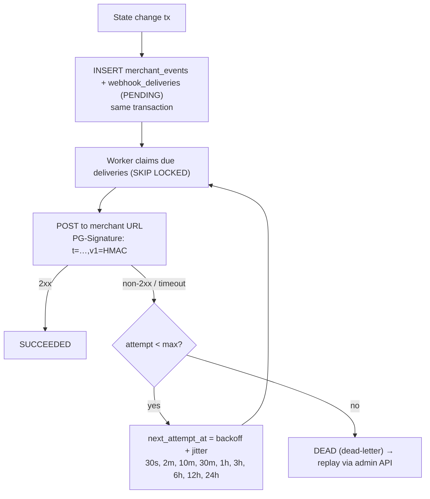

### 4.8 Refund

```mermaid
sequenceDiagram
    autonumber
    participant M as Merchant
    participant RS as Refund service
    participant DB as PostgreSQL
    participant P as PSP
    M->>RS: POST /v1/payments/{id}/refunds {amount} (Idempotency-Key)
    rect rgb(235,245,255)
    RS->>DB: SELECT payment FOR UPDATE
    RS->>DB: sum(non-failed refunds) + amount <= captured ? else 422
    RS->>DB: INSERT refund INITIATED
    end
    RS->>P: refund (ref = refundId)
    P-->>RS: PENDING / SUCCEEDED / FAILED, or timeout → UNKNOWN
    RS->>DB: apply outcome; SUCCEEDED → payment.amount_refunded += amount
    RS-->>M: 201 refund
```

### 4.9 Reconciliation

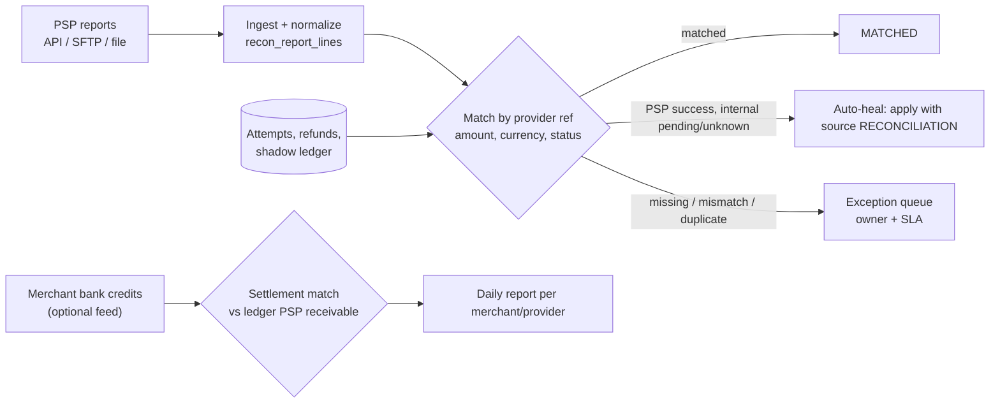

## 5. Data architecture

- **PostgreSQL is the single source of truth** for payments, attempts, refunds, idempotency, the webhook inbox and outbox, routing rules, and audit logs. Strong consistency comes from row locks on the payment row plus database constraints (e.g. `amount_refunded <= amount_captured`).
- **Shard-ready from day one:** every table carries `merchant_id`, no transaction spans merchants, and ids are globally unique and time-ordered (ULID-style). The first scaling step is vertical plus partitioning; the second is sharding by `merchant_id` (e.g. Citus) — see §10.
- **Append-only records:** `payment_transitions`, `audit_log`, `ledger_transactions` and `ledger_entries` reject `UPDATE`/`DELETE` via triggers. Ledger balance is also enforced by a deferred constraint trigger at commit.
- **Partitioning plan** (when volume demands it, roughly 10× launch): monthly range partitions on the append-heavy tables (`payment_transitions`, `provider_webhook_events`, `merchant_events`, `webhook_deliveries`, `idempotency_records`), managed with pg_partman; retention is enforced by dropping partitions.
- **Read path:** reporting and analytics go to a read replica (Aurora reader), never the writer.

## 6. Consistency and reliability model

| Pattern | Where | Guarantee |
|---|---|---|
| Short transactions, never across PSP calls | Orchestrator, refunds, resolver | No lock held during network I/O; crash-safe via write-ahead `INITIATED` records |
| Pessimistic row lock on the payment + version column | All payment mutations | Serializes the API, webhooks, and workers per payment. Different payments never contend |
| Monotonic state machines | Attempt, payment, refund | Duplicate and out-of-order events are no-ops; contradictions are flagged, never applied |
| Transactional outbox | Merchant events, deliveries | A state change and its notification commit atomically; delivery is at-least-once |
| Inbox | PSP webhooks | Stored before processing; deduplicated on provider event id; retried |
| Idempotency keys | Every mutating merchant API | Replay returns the original response; concurrent duplicates get 409 |
| Timeouts + retries with exponential backoff and full jitter | PSP calls (same PSP, idempotent ops), deliveries, resolver | Bounded load during incidents |
| Circuit breakers (Resilience4j) per provider | Adapter layer | Fail fast; routing avoids open circuits |
| Bulkheads | Separate HTTP client pools per provider; worker concurrency limits | One slow PSP cannot exhaust shared resources |
| Rate limiting | WAF rate rules (edge) + per-merchant token bucket (app, later phase) | Protects the platform from noisy clients |
| Backpressure | Workers claim bounded batches; Hikari pool limits; 503 + `Retry-After` when saturated | Graceful degradation |

**CAP stance.** For money movement we choose **consistency over availability**: if the primary database is unavailable, mutating APIs fail fast (503) instead of accepting writes we cannot durably order. Reads can degrade to replicas. Merchant notifications are eventually consistent.

**No exactly-once.** Every hop (PSP ↔ gateway ↔ merchant) is at-least-once. Uniqueness constraints and idempotent transitions make re-delivery harmless.

## 7. Failure scenarios

| Scenario | Detection | Handling | Outcome guarantee |
|---|---|---|---|
| PSP timeout on initiate | Read timeout / ambiguous 5xx | Attempt → `UNKNOWN`; resolver polls; no failover | No double charge; eventually resolved or escalated at 72 h |
| PSP definitely unavailable | Connect refused, circuit open | Attempt → `FAILED (PROVIDER_UNAVAILABLE)`; fail over to next candidate | Customer experience preserved |
| Duplicate PSP webhook | `UNIQUE(provider, event_id)` | Acknowledged, ignored | Applied once |
| Webhook arrives before the API response | The tx2 lock waits for or follows the webhook tx | Transitions are monotonic; the later writer sees the newer state and no-ops | Same final state regardless of order |
| API response lost after success | Merchant retries with the same Idempotency-Key | Stored response replayed | Merchant sees the true state; no second attempt |
| PSP reports an unknown status | Adapter maps it to `PENDING` + raw status logged | Resolver keeps polling; alert on unknown codes | Never guessed |
| PSP success with wrong amount | Amount check in webhook/status processing | Not applied; flagged for reconciliation | Tampered or partial payments are not accepted |
| Late success after expiry or failure | Success on a terminal payment | Per merchant policy: auto-refund (default) or accept | Customer money is never silently kept |
| Two attempts both succeed | Success on an already-succeeded payment | Auto-refund the extra attempt | At most one charge kept |
| Database unavailable | Hikari timeouts | Fail fast (503); webhooks are rejected so PSPs retry; workers pause | No accepted-but-unrecorded state |
| Worker crash mid-job | Lease expiry | Another worker reclaims | Work is completed at least once |
| Broker unavailable | n/a in V1 (no broker) | — | — |
| Merchant endpoint down | Non-2xx / timeouts | Backoff for ~48 h, then DEAD + replay | Events never dropped silently |
| Network partition to a PSP | Timeouts / circuit opens | Unknowns resolved after recovery; new traffic routed elsewhere | Correctness over availability for affected attempts |

## 8. Security architecture

- **Edge:** AWS WAF (managed rules, rate-based rules, geo rules) → ALB with TLS 1.2+ (TLS 1.3 policy); HSTS.
- **Merchant auth:** secret API keys (`sk_test_…`), 256-bit random, stored as SHA-256 hashes. Rotation is supported by having several active keys.
- **Admin auth:** V1 uses static admin tokens from Secrets Manager (constant-time compare). The target is OIDC SSO with roles `ADMIN`, `OPS`, `FINANCE`, `READ_ONLY`, and maker-checker for manual adjustments.
- **PSP webhooks:** per-provider signature verification (HMAC or provider scheme), timestamp tolerance, event-id dedupe, optional source-IP allowlists at the WAF.
- **Merchant webhooks:** `PG-Signature: t=<unix>,v1=<hex HMAC-SHA256(secret, t + "." + body)>`. Merchants verify with a 5 min tolerance.
- **SSRF:** merchant webhook URLs must be HTTPS and are resolved and checked against private, loopback, link-local, and metadata ranges on every delivery.
- **Secrets & keys:** AWS Secrets Manager for credentials; KMS envelope encryption for merchant webhook secrets and PSP credentials (V1 code uses AES-256-GCM with a data key from configuration, which KMS supplies in AWS).
- **Data:** encryption at rest (Aurora + KMS) and in transit (TLS to the DB). No PAN or CVV anywhere; PII minimized and masked in logs.
- **Egress:** NAT gateways with Elastic IPs give static egress IPs for PSP allowlisting.
- **Least privilege:** separate IAM task roles for API and worker; the DB app user has no DDL rights (migrations run as a separate migration role).

## 9. Observability

- **Correlation:** `X-Request-Id` accepted or generated → MDC (`request_id`, `merchant_id`, `payment_id`) → response header, log lines, and trace attributes.
- **Traces:** OpenTelemetry via Micrometer Tracing, exported over OTLP to AWS X-Ray or Grafana Tempo. Spans cover HTTP in/out and PSP calls (`provider`, `operation`).
- **Metrics:** Prometheus format at `/actuator/prometheus` (scraped by the ADOT collector into Amazon Managed Prometheus). Key series: `pg_payments_created_total`, `pg_payment_attempts_total{provider,method,outcome}`, `pg_provider_call_seconds{provider,operation,result}`, `pg_webhooks_inbound_total{provider,result}`, `pg_webhook_deliveries_total{result}`, `pg_status_checks_total{outcome}`, `pg_payments_late_success_total{action}`, `pg_provider_amount_mismatches_total`.
- **Logs:** JSON (ECS format) in the `prod` profile; never bodies, keys, secrets, PAN, or CVV.
- **Alerts (SLO-based):** attempt success rate per provider below baseline, provider p99 latency, unknown attempts older than 1 h, webhook DEAD count > 0, error-budget burn rate.

## 10. Deployment architecture

### Local
`docker compose up` starts PostgreSQL and the application (profile `local`). Without Docker, `./gradlew bootTestRun` starts the app against an embedded PostgreSQL.

### AWS reference deployment

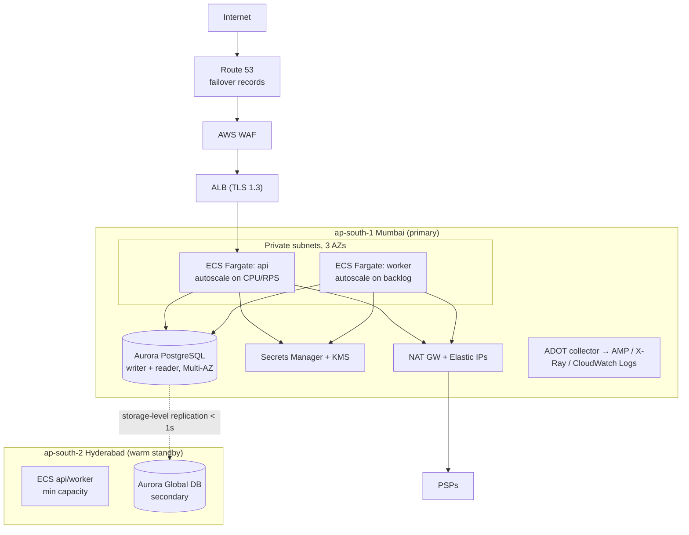

- **Deploys:** rolling with ECS deployment circuit breaker and automatic rollback; readiness gates on `/actuator/health/readiness`. Canary (weighted target groups) comes once real traffic exists.
- **Migrations:** Flyway runs as a one-off ECS task before the service update; expand/contract only.
- **Backups:** Aurora continuous backup (PITR, 35 days) plus daily snapshots copied to Hyderabad; everything stays in India.
- **DR:** Aurora Global Database (RPO typically < 1 s) with managed failover, and ECS scaled up in Hyderabad through a runbook. RTO target 30 min; DR drills quarterly.
- **Infrastructure as code:** Terraform modules (network, ecs-service, aurora, waf, observability), with state in S3 and DynamoDB locking.

## 11. Evolution path

| Trigger | Change |
|---|---|
| Multiple event consumers / analytics | Generic outbox relay → Amazon SQS/SNS or MSK (Kafka) |
| Sustained > ~3–5k writes/s | Partition append-only tables; then shard by `merchant_id` (Citus / app-level) |
| Precise cross-instance rate limits or hot-path caching | ElastiCache (Redis/Valkey) |
| Independent scaling or ownership | Extract `webhook` delivery and `reconciliation` into services first (already async and DB-decoupled) |
| Holding funds | PA mode: escrow accounts, settlement engine, merchant balances in the ledger |
| BIN routing, saved cards across PSPs | Card-data service in an isolated CDE (PCI DSS Level 1) with network tokenization |
| Recurring | Mandate aggregate, pre-debit notification scheduler |
| Better routing | Cost-aware scoring, contextual bandits |
