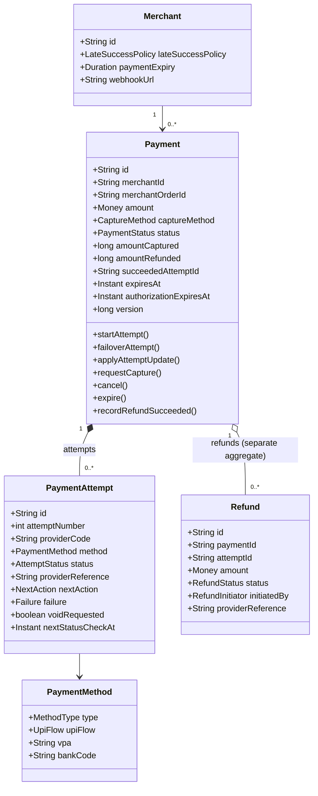
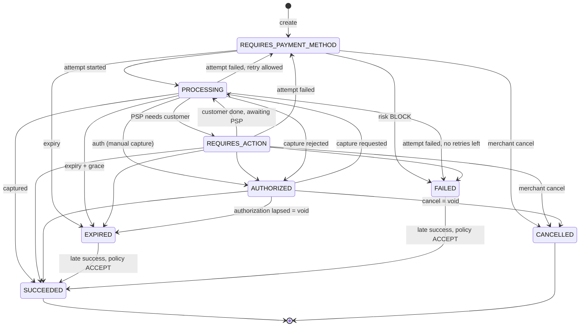
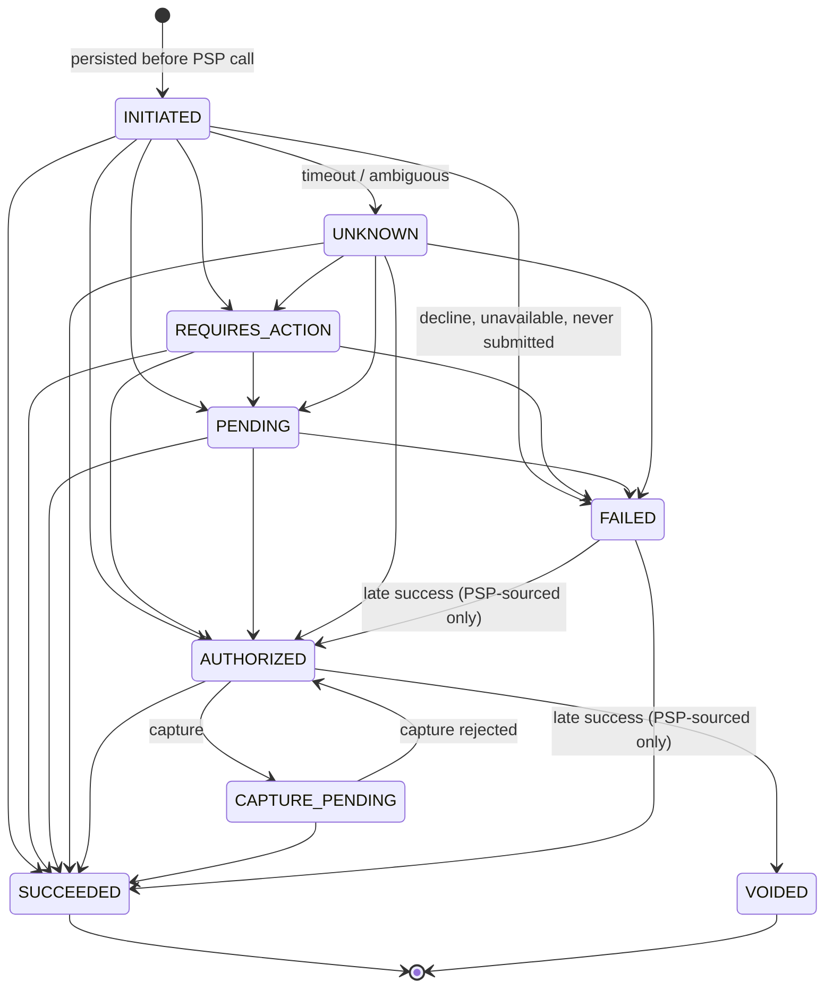
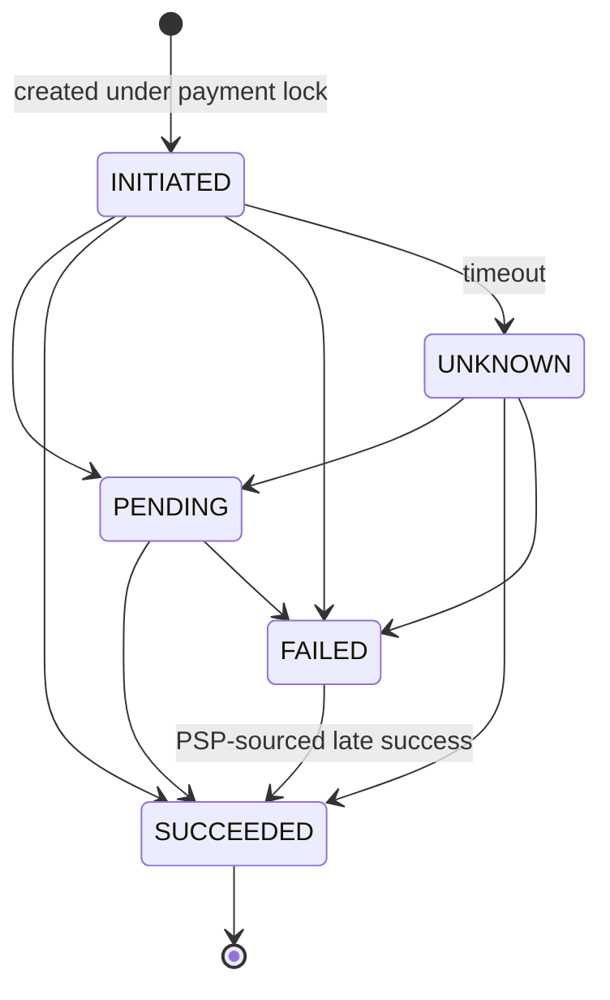
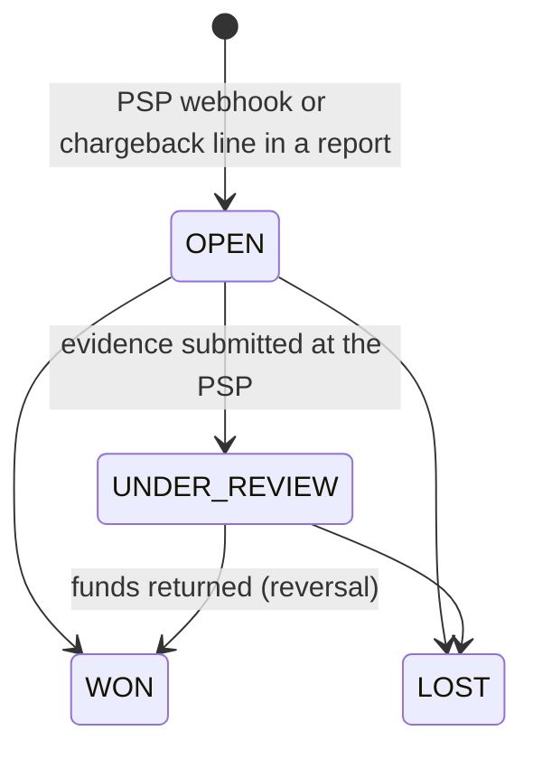
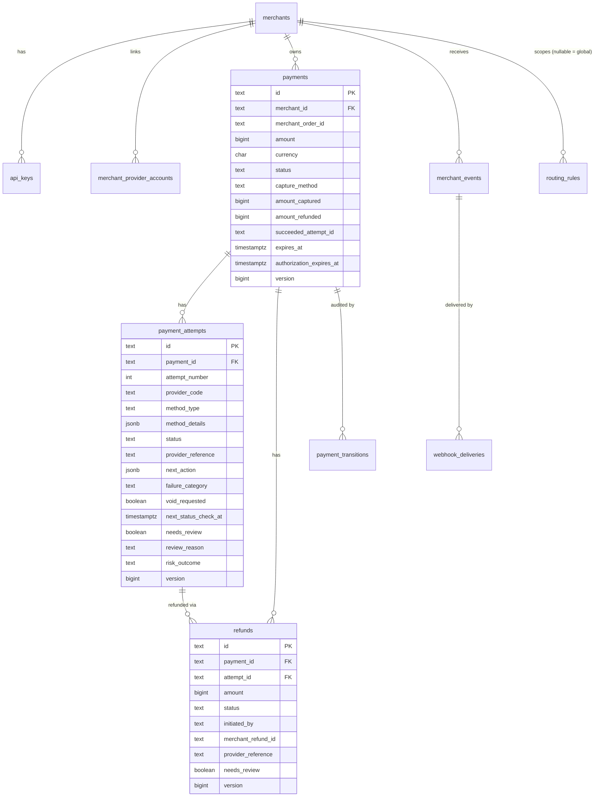

# Low-Level Design — Payment Gateway V1

| | |
|---|---|
| Phase | 4 — Low-level design |
| Status | Approved baseline (2026-09-26); updated as the implementation lands |
| Inputs | [requirements.md](requirements.md), [architecture.md](architecture.md) |

---

## 1. Code organization

A single Gradle module organized by **business module**, then by layer. Boundaries are enforced by ArchUnit tests (`ArchitectureTest`).

```
com.payments.gateway
├── shared         Money, Ids, ApiException/ErrorCode, crypto, JSON, request-id filter, error handler
├── merchant       Merchant, API keys, provider accounts, auth filters, admin API
├── idempotency    IdempotencyService + repository
├── provider
│   ├── spi        PaymentProvider SPI, capability + result model, exceptions   ← the only thing core code sees
│   ├── (root)     ProviderRegistry, ProviderClient (circuit breakers, metrics), ProviderHealthTracker
│   └── mock       Mock PSPs (MOCK_ALPHA, MOCK_BETA), in-memory PSP state, simulator endpoints
├── routing        RoutingEngine, rules (DB), strategies, admin API
├── risk           RiskEngine + rules
├── payment
│   ├── domain     Payment (aggregate root), PaymentAttempt, Refund, state enums, transitions — no Spring/JDBC
│   ├── application PaymentService, PaymentOutcomeService, RefundService, StatusResolver, ExpiryJob
│   ├── infrastructure JDBC repositories
│   ├── api        Request/response DTOs + mapper (the module's published language)
│   └── web        Controllers
└── webhook
    ├── inbound    PSP webhook receiver, inbox, retry job
    └── outbound   Merchant event recorder (outbox), delivery worker, signer, SSRF guard
```

**Dependency rules** (tested):
1. `..domain..` depends only on `shared` and the JDK.
2. Only a module's own `application` layer uses its `infrastructure`.
3. Core modules reach PSPs only through `provider.spi` and `ProviderClient`; nothing outside `provider.mock` imports it.
4. `webhook` never imports `payment.infrastructure` or `payment.domain` internals. It talks to the payment module through `PaymentOutcomeService` (inbound) and Spring events (outbound).

## 2. Domain model



- **Payment** is the merchant's intent: one per checkout or order. It is the aggregate root for its attempts; every mutation locks the payment row.
- **PaymentAttempt** is one try at one PSP with one method. It carries the PSP reference, the next action, and failure details.
- **Refund** is its own aggregate. It is created under the payment lock so the refundable-amount invariant holds under concurrency.
- **Money** is an integer amount in minor units (`long`) plus an ISO 4217 currency. Arithmetic is overflow-checked, and currency mismatches are rejected.

### Identifiers

| Prefix | Entity | Notes |
|---|---|---|
| `mer_` | Merchant | |
| `key_` | API key record | The secret itself is `sk_test_<43 chars base64url>`, shown once |
| `pay_` | Payment | |
| `att_` | Attempt | Sent to PSPs as the merchant reference / idempotency key |
| `rfnd_` | Refund | Sent to PSPs as the refund reference / idempotency key |
| `evt_` | Merchant event | |
| `whd_` | Webhook delivery | |
| `pwe_` | PSP webhook (inbox) record | |
| `rr_` | Routing rule | |
| `mpa_` | Merchant provider account | |

Format: `prefix_` + 26-character Crockford base32 ULID (48-bit millisecond timestamp + 80 random bits). Ids are globally unique, roughly time-ordered (index-friendly), and carry no merchant data.

Other identifiers: `merchant_order_id` (merchant's key, indexed, not unique — an order can have several payments), `provider_reference` (PSP id, unique per provider), `Idempotency-Key` (per merchant), `X-Request-Id` (per HTTP request, propagated to logs and traces).

## 3. State machines

### 3.1 Payment



The payment status is **derived from the active attempt** plus payment-level commands (cancel, expire):

| Active attempt status | Payment status |
|---|---|
| `INITIATED`, `PENDING`, `UNKNOWN`, `CAPTURE_PENDING` | `PROCESSING` |
| `REQUIRES_ACTION` | `REQUIRES_ACTION` |
| `AUTHORIZED` | `AUTHORIZED` (manual capture) — with automatic capture the platform captures and the payment shows `PROCESSING` |
| `SUCCEEDED` | `SUCCEEDED` |
| `FAILED` | `REQUIRES_PAYMENT_METHOD` if attempts < max (default 5) and not expired, otherwise `FAILED` |
| `VOIDED` | `CANCELLED` or `EXPIRED` (whichever command caused the void) |

Refunds and disputes are **not** payment states. The payment exposes `amount_refunded`, and refunds and disputes have their own lifecycles (see 3.3 and 3.5).

**Cancel** is allowed from `REQUIRES_PAYMENT_METHOD`, `REQUIRES_ACTION`, and `AUTHORIZED` (void). It is rejected in `PROCESSING` because money may be moving; such payments resolve or expire instead.

### 3.2 Attempt



Rules applied by `PaymentAttempt.transition(...)`:
- **Same state → no-op** (duplicate webhook or repeated status check).
- **Stale update → no-op.** For example `PENDING` arriving after `SUCCEEDED`. Transitions are monotonic by rank.
- **Contradiction → conflict, not applied.** For example the PSP says `FAILED` after `SUCCEEDED`. The event is logged, counted in a metric, and left for reconciliation.
- `FAILED → SUCCEEDED/AUTHORIZED` is accepted **only** from PSP-sourced evidence (`PROVIDER_WEBHOOK`, `STATUS_CHECK`, `RECONCILIATION`), never from an API call.
- A reported success whose amount or currency differs from the attempt is **not applied** (flagged `amount_mismatch`).

**Late and duplicate success** (attempt reaches `SUCCEEDED` while the payment cannot take it):

| Payment state | Result |
|---|---|
| Active (not terminal) | Payment → `SUCCEEDED`, `succeeded_attempt_id` set |
| `SUCCEEDED` by another attempt | Duplicate → system refund of the extra attempt (`SYSTEM_DUPLICATE_SUCCESS`) |
| `EXPIRED` / `FAILED`, policy `ACCEPT` | Payment → `SUCCEEDED` (late) |
| `EXPIRED` / `FAILED`, policy `AUTO_REFUND` | Payment stays terminal → system refund (`SYSTEM_LATE_SUCCESS`) |
| `CANCELLED` | Always a system refund (the merchant explicitly declined) |

A late or duplicate **authorization** (no money has moved yet) is always voided, whatever the policy.

### 3.3 Refund



Invariant (per attempt): `Σ amount(refunds where status ≠ FAILED) ≤ attempt amount` for succeeded attempts. `payments.amount_refunded` counts `SUCCEEDED` refunds of the winning attempt only, and a database `CHECK (amount_refunded <= amount_captured)` backs it up.

### 3.4 Merchant webhook delivery

`PENDING → SUCCEEDED` on a 2xx response. On failure it stays `PENDING` and is rescheduled with backoff; after the last attempt it becomes `DEAD`. `DEAD → PENDING` happens through replay.

### 3.5 Dispute (ADR-018)



Ranks: `OPEN` 1, `UNDER_REVIEW` 2, `WON`/`LOST` 3. A lower-ranked report is stale and ignored. A contradicting final report is not applied and flags the dispute (`provider_conflict`). Opening posts the chargeback; winning posts its reversal. Refundable amount = captured − active refunds − disputes not won.

## 4. Transaction boundaries and algorithms

### 4.1 Confirm

```text
confirm(merchant, paymentId, method, client):
  p0 = repo.findPayment(paymentId)                -- no lock
  risk = p0 looks confirmable ? riskEngine.evaluate(ctx) : ALLOW   -- may call a vendor; outside the lock (ADR-016)
  tx1:
    p = repo.lockPayment(paymentId)               -- SELECT … FOR UPDATE, loads attempts
    require p.status == REQUIRES_PAYMENT_METHOD and now < p.expiresAt
    if risk == BLOCK: p.markRiskBlocked(); save; return p
    decision = routing.route(ctx)                 -- ordered candidates; empty → 422/503
    a = p.startAttempt(newId("att"), method, decision.first)   -- attempt INITIATED, payment PROCESSING
    p.recordRisk(a, risk)                         -- REVIEW/CHALLENGE → flagged risk_review
    save(p)                                       -- commit: write-ahead record exists before any PSP call
  loop over candidates:
    try:
      result = providerClient.initiate(provider, request(ref = a.id))
      tx2: lock p; p.applyAttemptUpdate(a.id, result, PROVIDER_RESPONSE); save; break
    catch ProviderUnavailable:                    -- definitely not processed
      tx: lock p; a = p.failoverAttempt(a.id, PROVIDER_UNAVAILABLE, next candidate) (or fail when none left); save
    catch ProviderTimeout:                        -- maybe processed
      tx: lock p; attempt → UNKNOWN; schedule status check; save; break
  after commit: auto-capture if the attempt is AUTHORIZED and capture_method = AUTOMATIC
  return p
```

`save(p)` writes the payment (`UPDATE … WHERE id=? AND version=?`), inserts new attempts, updates changed ones (version-checked), appends `payment_transitions`, and publishes merchant events into the outbox tables — all in the same transaction.

### 4.2 Applying PSP outcomes (webhook, status check, reconciliation)

`PaymentOutcomeService.applyProviderUpdate(providerCode, providerReference | attemptId, update, source)`:
1. Resolve the attempt → payment id (by `(provider_code, provider_reference)` or by attempt id).
2. tx: lock the payment; `applyAttemptUpdate`; handle the result flags:
   - `refundRequired` → create a system refund (in the same tx; executed after commit).
   - `captureRequired` → mark the attempt `CAPTURE_PENDING` and schedule it (executed after commit).
   - `amountMismatch` or `conflict` → metric + warning log with ids; the attempt is flagged for review with reason `amount_mismatch` or `provider_conflict` (§7.1).
3. After commit: record the final outcome in `ProviderHealthTracker` and run any follow-up PSP call.

### 4.3 Refund creation

```text
tx1: p = lockPayment; require status SUCCEEDED (or a system refund for a specific succeeded attempt)
     refundable = attempt.amount − Σ non-failed refunds(attempt)
     require 0 < amount ≤ refundable            -- else 422 amount_exceeds_refundable
     insert refund INITIATED; commit
call provider.refund(ref = refund.id)          -- outside tx
tx2: lock p; refund.transition(result); if SUCCEEDED: p.recordRefundSucceeded(); save
```

## 5. Provider SPI

```java
public interface PaymentProvider {
    String code();
    ProviderCapabilities capabilities();
    List<CredentialField> credentialFields();                              // what the admin API accepts per merchant account
    ProviderPaymentResult initiatePayment(MerchantAccount a, InitiatePaymentRequest r); // may throw ProviderUnavailableException / ProviderTimeoutException
    ProviderPaymentResult fetchPaymentStatus(MerchantAccount a, PaymentStatusQuery q);  // NOT_FOUND if the PSP never saw the reference
    ProviderPaymentResult capture(MerchantAccount a, CaptureRequest r);
    ProviderPaymentResult voidAuthorization(MerchantAccount a, VoidRequest r);
    ProviderRefundResult refund(MerchantAccount a, RefundRequest r);
    ProviderRefundResult fetchRefundStatus(MerchantAccount a, RefundStatusQuery q); // q: refundId, providerRefundReference (null after a timeout), paymentProviderReference, attemptId
    List<ProviderEvent> parseWebhook(MerchantAccount a, InboundWebhook w); // a == null on the provider-wide endpoint; throws WebhookVerificationException
    SettlementReport fetchSettlementReport(MerchantAccount a, SettlementReportQuery q);
}
```

**Merchant accounts** (ADR-014) work as follows:
- **What a call carries:** every call is made for one merchant's own account at the PSP, as `MerchantAccount(id, merchantId, providerCode, credentials)`.
- **Resolution:** `ProviderClient` resolves the account through the `MerchantAccountResolver` port, which the merchant module implements. This happens before the circuit breaker, so a lookup problem is never charged to the PSP.
- **Status:** accounts resolve whatever their status, because work already in flight on a disabled account must finish.
- **Logging:** `MerchantAccount.toString()` omits credential values.

**Capabilities** (used by routing and the orchestrator): supported method types and UPI flows, currencies, per-method amount limits, `manualCapture`, `voidSupported`, `partialRefunds`, `statusQuery`, and `requiresCustomerPhone`, which routing checks against the payment's customer (ADR-031). The orchestrator checks a capability before invoking an optional operation.

**Normalized outcomes:** `ProviderPaymentOutcome = REQUIRES_ACTION | PENDING | AUTHORIZED | SUCCEEDED | FAILED | VOIDED | NOT_FOUND`; `ProviderRefundOutcome = PENDING | SUCCEEDED | FAILED | NOT_FOUND`. Each result carries `providerReference`, `nextAction`, `failure (code, message, category)`, and the raw PSP status.

**Failure classification** decides retry and failover:

| Signal | Adapter maps to | Orchestrator action |
|---|---|---|
| Connect refused, DNS failure, circuit open | `ProviderUnavailableException` | Fail over to next candidate |
| PSP rejects the merchant account's credentials (401, or Razorpay's 400 "Authentication failed"), or the key's mode does not match the deployment | `ProviderCredentialsException` (a `ProviderUnavailableException`) | Fail over; attempt `FAILED (provider_credentials_rejected, VALIDATION)`. It does not count against the PSP's circuit or score. Metric `result=credentials_rejected`, WARN log with the account id |
| Read timeout, connection reset after send, ambiguous 5xx | `ProviderTimeoutException` | Attempt `UNKNOWN`; resolver |
| Business decline | `FAILED` result, category `ISSUER` / `CUSTOMER` | Payment back to `REQUIRES_PAYMENT_METHOD` |
| Invalid request / auth error at PSP | `FAILED` result, category `VALIDATION` / `PROVIDER` | Same, plus alert |

`FailureCategory = CUSTOMER | ISSUER | PROVIDER | PROVIDER_UNAVAILABLE | VALIDATION | RISK | TIMEOUT | NOT_SUBMITTED`. Only `PROVIDER`, `PROVIDER_UNAVAILABLE`, and `TIMEOUT` count against a provider's routing success rate.

`ProviderClient` wraps every call with a Resilience4j circuit breaker per provider (count window 20, minimum 10 calls, 50% failure threshold, 30 s open, 3 half-open probes). An open circuit turns half-open on a timer: routing skips open circuits, so no call would ever trigger the transition. Only technical failures count. It also records a latency timer `pg_provider_call_seconds{provider,operation,result}`.

### Mock providers (Phase 8)

`MOCK_ALPHA` supports UPI (intent, QR, collect), cards, and netbanking. `MOCK_BETA` supports UPI and cards. Both support manual capture, void, and partial refunds. PSP state is in memory (`MockPsp`), keyed by provider reference and by merchant reference (attempt id).

Deterministic scenarios by **amount paise suffix** (like PSP test cards):

| Suffix | Scenario |
|---|---|
| `…01` | Timeout on initiate, but the PSP processed it → status check returns `SUCCEEDED` (or `AUTHORIZED` for manual capture) |
| `…03` | Declined (`FAILED`, category `ISSUER`) |
| `…04` | `PENDING`; completes silently (no webhook) → found by status check |
| `…05` | Timeout on initiate, never processed → status check `NOT_FOUND` → attempt `FAILED (NOT_SUBMITTED)` |
| other | Card, netbanking, UPI intent/QR → `REQUIRES_ACTION` (redirect / intent URI / QR); UPI collect → `PENDING`. Completed through the simulator, which sends a signed webhook |

Refund amount suffix: `…07` pending (resolved by status check), `…08` timeout but processed, `…09` failed, otherwise immediate success.

Mock credentials are optional:
- An `api_key` starting with `bad_` is rejected with `ProviderCredentialsException`.
- A `webhook_secret` becomes that account's signing secret. Without one, the platform secret `pg.providers.mock.webhook-secret` is used.
- The simulator delivers each transaction's webhooks to its merchant account endpoint.

Simulator endpoints (only when `pg.providers.mock.enabled=true`):
- `GET /simulator/{provider}/checkout/{providerReference}` — HTML "PSP hosted page" with Pay / Fail buttons.
- `POST /simulator/{provider}/payments/{providerReference}/complete` `{"outcome":"success|failure","duplicate_webhook":false}` — completes and sends the webhook(s).
- `POST /simulator/{provider}/availability` `{"available":false}` — simulates a PSP outage (tests failover).

### Razorpay (ADR-030)

Enabled with `pg.providers.razorpay.enabled=true`. Merchant credentials are `key_id`, `key_secret` and `webhook_secret`, all required. The key must be `rzp_test_…` on a TEST deployment and `rzp_live_…` on LIVE.

| Operation | Razorpay calls | Provider reference / idempotency key |
|---|---|---|
| Initiate (default) | `POST /payment_links`, redirect to `short_url` | `plink_…` / `reference_id` = attempt id |
| Initiate (UPI, `upi-s2s`, phone and email known) | `POST /orders`, then `POST /payments/create/upi` (`flow=intent`) | `order_…` / `receipt` = attempt id |
| Status | `GET /payment_links/{id}` or `/orders/{id}`, then `/orders/{id}/payments`; without a reference, `GET /payment_links?reference_id=`, then `GET /orders?receipt=` | — |
| Capture | `POST /payments/{pay}/capture` (skipped if already captured) | — |
| Refund / status | `POST /payments/{pay}/refund`; `GET /refunds/{id}`, or the payment's refund list matched by receipt | `receipt` = refund id |
| Void | Not supported (`voidSupported=false`) | — |

Webhooks are accepted only on `/v1/webhooks/providers/RAZORPAY/{account}`. Each needs `X-Razorpay-Signature` (a hex HMAC-SHA256 of the raw body with the account's `webhook_secret`, compared in constant time) and `X-Razorpay-Event-Id` (the inbox dedupe key). A `payment.failed` event maps to `PENDING`; the status check fails the attempt only after `hosted-page-ttl`.

### Cashfree (ADR-031)

Enabled with `pg.providers.cashfree.enabled=true`. Merchant credentials are `client_id` and `client_secret`, sent as `x-client-id` and `x-client-secret` along with `x-api-version`. Amounts go out in rupees (`BigDecimal(paise, 2)`) and are read back exactly. `requiresCustomerPhone=true`, so routing skips Cashfree for payments without a phone.

| Operation | Cashfree calls | Provider reference / idempotency key |
|---|---|---|
| Initiate (default) | `POST /links`, redirect to `link_url` | `cflink_<cf_link_id>` / `link_id` = attempt id |
| Initiate (UPI, `upi-s2s`) | `POST /orders`, then `POST /orders/sessions` (`upi.channel` `link` or `qrcode`) | attempt id / `order_id` = attempt id |
| Status | Link: `GET /links/{attempt}`, plus `/links/{attempt}/orders` and that order's `/payments` when paid. Order: `GET /orders/{id}` and `/orders/{id}/payments`. Without a reference: link first, then order | — |
| Refund / status | `POST /orders/{paid order}/refunds`; `GET /orders/{paid order}/refunds/{refund id}`. The paid order is the attempt's own order, or the link's `CFPay_…` order | `refund_id` = refund id |
| Capture / void | Automatic capture only (capture re-reads the status); void not supported | — |

Webhooks are accepted only on `/v1/webhooks/providers/CASHFREE/{account}`. The signature is Base64(HMAC-SHA256(`x-webhook-timestamp` + raw body)) with the account's `client_secret`, compared in constant time. The inbox dedupe key is `sha256:` of the body, never the unsigned `x-idempotency-key`. Failed and user-dropped payments map to `PENDING`. Link payments arrive on a `CFPay_…` order and are matched through `order_tags.cf_link_id`; disputes on such orders are matched by reading the order's tags.

## 6. Routing engine

```text
route(ctx):
  candidates = merchant-linked providers
             ∩ capability match (method, UPI flow, currency, amount range, manual capture)
             − providers whose circuit is OPEN − ctx.excluded
  for rule in merchantRules(priority asc) ++ globalRules(priority asc):
      if rule.enabled and all(rule.conditions match ctx):
          ordered = strategy(rule, targets ∩ candidates)
          if ordered non-empty:
              if rule.allowFallback: ordered += (candidates − ordered) by health score
              return decision(ordered, rule.id)
  return decision(DYNAMIC(candidates), rule = null)
```

Rule document (`routing_rules` row):

```json
{
  "name": "UPI high value to Alpha",
  "merchant_id": null,
  "priority": 10,
  "conditions": [
    {"field": "method", "op": "eq", "value": "upi"},
    {"field": "amount", "op": "gte", "value": 500000}
  ],
  "strategy": "WEIGHTED",
  "targets": [{"provider": "MOCK_ALPHA", "weight": 80}, {"provider": "MOCK_BETA", "weight": 20}],
  "allow_fallback": true
}
```

Fields: `method`, `upi_flow`, `bank_code`, `amount`, `currency`, `capture_method`. Operators: `eq`, `neq`, `in`, `not_in`, `gt`, `gte`, `lt`, `lte`.

Strategies:
- `PRIORITY` keeps the target order.
- `WEIGHTED` picks the first by weighted random, then orders the rest by weight.
- `DYNAMIC` orders by health score: `score = attributableSuccessRate − 0.1 · min(1, ewmaLatencyMs / 5000)`. A provider with fewer than 20 samples gets a prior success rate of 0.95. The window is the last 100 final outcomes per provider and method.

Rules are cached per instance, refreshed every 30 s, and invalidated immediately on admin writes. Health is per instance (see [ADR-011](decisions/ADR-011-no-redis-v1.md)).

## 7. Risk engine

`RiskEngine.evaluate(RiskContext) → RiskDecision(outcome, reasons)`. The rules are Spring beans implementing `RiskRule`. The most severe outcome wins: `BLOCK > CHALLENGE > REVIEW > ALLOW`.

| Rule | Logic (config under `pg.risk`) |
|---|---|
| `AmountLimitRule` | `> review-threshold` (₹2,00,000) → `REVIEW`; `> block-threshold` (₹10,00,000) → `BLOCK` |
| `BlocklistRule` | VPA, IP, email, customer reference in the configured blocklists → `BLOCK` |
| `VelocityRule` | More than `max-attempts-per-customer` (10) attempts by the same customer reference in `velocity-window` (10 min) → `BLOCK` |

External providers implement `RiskRule` too. `ExternalRiskRule` (enabled by `pg.risk.external.url`) posts a signed JSON context to a fraud vendor with a hard timeout. A timeout, error or unknown answer becomes `REVIEW` (`external_risk_unavailable` / `external_risk_invalid_response`): fail open for availability, but never unseen. The engine also turns any exception from a rule into `REVIEW risk_rule_error`. Rules run before the payment row is locked (§4.1), and the decision is stored on the attempt (`risk_outcome`, `risk_reasons`). See [ADR-016](decisions/ADR-016-review-queue-and-risk.md).

### 7.1 Manual review queue

| Reason | Raised when | Typical action |
|---|---|---|
| `amount_mismatch` | PSP reports success for a different amount; the update is not applied | Contact the PSP; refund or adjust via reconciliation |
| `provider_conflict` | PSP contradicts a final state (e.g. refund `failed` after `succeeded`) | Confirm with the PSP; correct via refund or reconciliation |
| `status_unresolved` | 72 h of status checks without a final answer; polling stops | Chase the PSP; reconciliation heals from the settlement report |
| `risk_review` | Risk outcome `REVIEW`/`CHALLENGE`; the payment proceeds | Check the customer; refund if fraudulent |

Flags live on the attempt or refund (`needs_review`, `review_reason`, `flagged_at`). Reasons accumulate while open. `GET /admin/v1/reviews` lists open items oldest first. Resolving (`POST …/resolve {note}`) takes the payment lock, clears the flag, and writes `review.resolved` to the audit log. It never changes money state.

## 8. Idempotency

Table `idempotency_records (merchant_id, idempotency_key) PK`, `request_hash`, `status IN_PROGRESS|COMPLETED`, `response_status`, `response_body`, `locked_until`, `expires_at`.

```text
run(merchant, key, fingerprint, action):
  INSERT … ON CONFLICT DO NOTHING (IN_PROGRESS, locked_until = now + 30s)     -- autocommit
  if inserted → execute
  else existing = SELECT
       existing.hash ≠ fingerprint            → 422 idempotency_key_reuse
       COMPLETED                              → replay stored status + body (Idempotent-Replayed: true)
       IN_PROGRESS and locked_until > now     → 409 idempotency_request_in_progress (Retry-After: 1)
       IN_PROGRESS and lease expired          → conditional UPDATE takeover → execute
  execute:
    2xx result or 4xx business ApiException → store and mark COMPLETED
    anything else (5xx, unexpected)         → DELETE record so a retry re-executes
```

- **Fingerprint:** SHA-256 over `METHOD path \n canonical JSON(request DTO)`. Canonicalization makes semantically equal bodies match regardless of whitespace or key order.
- Re-execution is safe because operations are idempotent at the domain level too. A repeated confirm finds the existing attempt, and PSP calls reuse `att_…` / `rfnd_…` as PSP-side idempotency keys.
- Retention is 7 days (`pg.idempotency.ttl`); a worker purges expired rows in batches.
- Webhooks use their own dedupe: `UNIQUE(provider_code, provider_event_id)` on the inbox, plus idempotent transitions.

## 9. Webhooks

### 9.1 Inbound (PSP → gateway)
There are two endpoints:
- **Merchant account endpoint:** `POST /v1/webhooks/providers/{code}/{account_id}`. Use it for PSPs where each merchant owns the account, which is the orchestrator default. The admin API returns its path as `webhook_path`, to configure at the PSP.
- **Provider-wide endpoint:** `POST /v1/webhooks/providers/{code}`, for platform-level secrets only (for example, the mocks' shared secret).

Processing:
1. Resolve the account; it must exist and belong to `{code}`, otherwise `404`.
2. The adapter's `parseWebhook(account, …)` verifies the signature with that account's secret (the mock uses `X-Mock-Signature: t=…,v1=HMAC-SHA256(secret, t + "." + body)`, 5 min tolerance).
3. Insert into `provider_webhook_events` with `merchant_account_id` and `merchant_id`. Deduplication is `UNIQUE NULLS NOT DISTINCT (provider_code, merchant_account_id, provider_event_id)`, so one account cannot claim another's event ids.
4. Process inline. **Tenant scope:** because the merchant holds its account's signing secret, events from an account endpoint may only change that merchant's attempts and refunds. Anything else is stored `IGNORED`, logged at WARN and counted as `pg.webhooks.inbound{result=foreign_resource}`.
5. Respond `200`, or `401` if the signature is invalid.

Failed processing stays `RECEIVED` with `next_attempt_at`, and `InboxRetryJob` retries it with backoff (max 10). Retries keep the merchant scope. The request body is capped at 256 KB.

### 9.2 Outbound (gateway → merchant)
- `MerchantEventRecorder` listens to `MerchantEventRequested` **inside** the state-change transaction and inserts `merchant_events` + `webhook_deliveries`. This is the transactional outbox.
- `WebhookDeliveryWorker` claims due deliveries (`FOR UPDATE SKIP LOCKED`, lease 60 s), validates the URL (SSRF), POSTs with a 2 s connect / 5 s read timeout, and records the result.
- Headers: `PG-Event-Id`, `PG-Event-Type`, `PG-Signature: t=<unix>,v1=<hex>`. After `POST /admin/v1/merchants/{id}/webhook-secret`, the previous secret stays valid for `previous_valid_for_seconds` (default 24 h, `0` for a compromise). Until then the header carries one `v1` per valid secret, so merchants can switch without failed deliveries.
- Body: `{"id":"evt_…","type":"payment.succeeded","created_at":"…","data":{"object":{…payment resource…}}}`.
- Retry schedule: 30 s, 2 m, 10 m, 30 m, 1 h, 3 h, 6 h, 12 h, 24 h (±20% jitter), which is 10 attempts over ≈ 47 h, then `DEAD`. `POST /admin/v1/webhook-deliveries/{id}/replay` re-queues it.

## 10. Workers

All workers use the **claim-with-lease** pattern, so they are safe with N replicas:

```sql
UPDATE payment_attempts SET next_status_check_at = :leaseUntil
 WHERE id IN (SELECT id FROM payment_attempts
               WHERE next_status_check_at <= :now
               ORDER BY next_status_check_at
               LIMIT :batch
               FOR UPDATE SKIP LOCKED)
RETURNING id, payment_id, provider_code, status, …;
```

| Job | Interval | Work |
|---|---|---|
| `StatusResolver` (attempts) | 1 s | For `INITIATED` older than 30 s, `UNKNOWN`, `PENDING`, `REQUIRES_ACTION`, `CAPTURE_PENDING`: fetch status and apply. `NOT_FOUND` on `INITIATED`/`UNKNOWN` → `FAILED (NOT_SUBMITTED)`. `AUTHORIZED` with `void_requested`: void. `CAPTURE_PENDING` still authorized at the PSP: re-issue capture |
| `StatusResolver` (refunds) | 1 s | `INITIATED` (stale), `UNKNOWN`, `PENDING`: fetch refund status, or re-submit if `NOT_FOUND` |
| `ExpiryJob` | 5 s | Expire due payments (see FR-P7); for an authorized payment set `void_requested` |
| `InboxRetryJob` | 5 s | Reprocess `RECEIVED` PSP webhooks |
| `WebhookDeliveryWorker` | 1 s | Deliver merchant webhooks |
| `RetentionJob` | 1 h | Batched deletes of expired idempotency records, checkout sessions, handled PSP webhooks and finished merchant deliveries (ADR-015) |

Status-check backoff: 5 s, 10 s, 30 s, 1 m, 2 m, 5 m, 10 m, 30 m, 1 h, then every 2 h. After 72 h from creation, polling stops and the item is flagged for review with reason `status_unresolved` (§7.1); `pg.reviews.open` drives the alert.

## 11. Database schema

Migrations: [src/main/resources/db/migration](../src/main/resources/db/migration). Conventions: `text` ids, `bigint` minor-unit amounts with `CHECK > 0`, `timestamptz` everywhere (UTC), `jsonb` only for open-ended data (metadata, method details, next action, rule definitions), and a `version` column on mutable aggregates.



Key constraints and indexes:

| Table | Constraint / index | Purpose |
|---|---|---|
| `payments` | `CHECK amount_refunded <= amount_captured <= amount` | Money invariants in the DB |
| `payments` | `(merchant_id, created_at DESC)`, `(merchant_id, merchant_order_id)` | Merchant queries |
| `payments` | Partial `(expires_at)` for active statuses; `(authorization_expires_at)` for `AUTHORIZED` | Expiry job |
| `payment_attempts` | `UNIQUE (payment_id, attempt_number)` | Ordering, no duplicate attempts |
| `payment_attempts` | Partial `UNIQUE (provider_code, provider_reference)` | Webhook lookup; one PSP txn per attempt |
| `payment_attempts` | Partial `(next_status_check_at)` | Resolver claims |
| `refunds` | Partial `UNIQUE (merchant_id, merchant_refund_id)` | Merchant-level refund idempotency |
| `idempotency_records` | `PK (merchant_id, idempotency_key)`, `(expires_at)` | Dedupe + purge |
| `provider_webhook_events` | `UNIQUE (provider_code, provider_event_id)` | Inbound dedupe |
| `webhook_deliveries` | Partial `(next_attempt_at) WHERE status='PENDING'` | Delivery claims |
| `payment_transitions`, `audit_log` | Triggers reject `UPDATE`/`DELETE` | Immutability |
| `merchant_events` | `payload` is `text`, not `jsonb` | `jsonb` reorders keys; deliveries must be byte-identical to what was signed |

**Isolation:** `READ COMMITTED` plus explicit `SELECT … FOR UPDATE` on the payment row serializes writers per payment; version checks are a second safety net. No `SERIALIZABLE` needed, because every invariant is checked under the row lock.

**Retention (ADR-015):** `payments`, `payment_attempts`, `refunds`, `payment_transitions`, ledger, reconciliation and `audit_log` are kept ≥ 8 years (archived to cold partitions / S3 in `ap-south-1` after 13 months) and are never deleted by the application. `RetentionJob` purges `provider_webhook_events` after 180 days, `merchant_events` / `webhook_deliveries` after 90 days, and `idempotency_records` after 7 days.

## 12. REST API (V1)

Base path `/v1`. JSON uses snake_case; amounts are integers in minor units; timestamps are ISO-8601 UTC. Every mutating `POST` requires `Idempotency-Key`. Authentication is `Authorization: Bearer sk_test_…`.

The merchant API contract is [openapi.yaml](openapi.yaml) (OpenAPI 3.1, contract-first). `ApiContractTest` checks three things:
- **Endpoint parity:** every `/v1` handler is documented, and every documented operation exists.
- **Real exchanges:** representative requests and responses match the documented status, media type, required headers and schema. For the test, object schemas are made strict (`additionalProperties: false`), so an undocumented response field fails the build. The published file stays lenient so that clients ignore unknown fields.
- **Webhooks:** merchant webhook bodies match the `Event` schema.

**Rate limits** (ADR-011) are per merchant and per API instance, with separate token buckets for reads (`GET`/`HEAD`) and writes. Defaults are 200/s with a burst of 400 for reads, and 100/s with a burst of 200 for writes; the effective global limit is about these values times the instance count.
- The filter runs after API-key authentication and before idempotency. A `429 rate_limited` (with `Retry-After`) therefore never creates an idempotency record, and the same key can be retried.
- PSP webhooks and unauthenticated requests are not counted.

| Method & path | Purpose | Success |
|---|---|---|
| `POST /v1/payments` | Create payment | `201` payment |
| `GET /v1/payments/{id}` | Retrieve | `200` payment |
| `POST /v1/payments/{id}/confirm` | Attach method, start attempt | `200` payment (+ `next_action`) |
| `POST /v1/payments/{id}/capture` | Capture an authorized payment | `200` payment |
| `POST /v1/payments/{id}/cancel` | Cancel / void | `200` payment |
| `POST /v1/payments/{id}/refunds` | Create refund | `201` refund |
| `GET /v1/payments/{id}/refunds` | List refunds of a payment | `200` list |
| `GET /v1/refunds/{id}` | Retrieve refund | `200` refund |
| `GET /v1/payments/{id}/disputes` | Disputes of a payment (oldest first) | `200` list |
| `GET /v1/disputes/{id}` | Retrieve dispute | `200` dispute |
| `POST /v1/checkout-sessions` | Hosted checkout session for a `requires_payment_method` payment (§17) | `201` session with `url` |
| `POST /v1/webhooks/providers/{code}` | PSP webhooks (signature-authenticated) | `200` |
| `POST /admin/v1/merchants` | Create merchant (+ webhook secret, shown once); `providers` optional | `201` |
| `GET/PATCH /admin/v1/merchants/{id}` | Read; update `name`, `webhook_url`, `late_success_policy`, `payment_expiry_seconds` | `200` |
| `DELETE /admin/v1/merchants/{id}/webhook-url` | Stop new webhooks (queued deliveries keep their URL) | `200` |
| `POST /admin/v1/merchants/{id}/webhook-secret` | Rotate `{previous_valid_for_seconds}`; new secret shown once | `200` |
| `POST /admin/v1/merchants/{id}/suspend` · `/reactivate` | Suspend `{reason}`: blocks API keys and checkout links. Payments in flight still complete, refund and reconcile | `200` |
| `POST /admin/v1/merchants/{id}/api-keys` | Issue an API key (shown once; `sk_test_`/`sk_live_` per `pg.security.api-key-mode`) | `201` |
| `GET /admin/v1/merchants/{id}/api-keys` · `POST …/api-keys/{key_id}/revoke` | List keys (hint, status, `last_used_at` hourly); revoke immediately | `200` |
| `GET /admin/v1/merchants/{id}/provider-accounts` | Accounts with masked credentials and `webhook_path` | `200` |
| `PUT /admin/v1/merchants/{id}/provider-accounts/{provider}` | Link or re-enable `{credentials}` (validated against the adapter's fields; replaces stored ones) | `200` |
| `POST /admin/v1/merchants/{id}/provider-accounts/{provider}/disable` | No new payments; in-flight work and reconciliation continue | `200` |
| `GET/PUT /admin/v1/merchants/{id}/rate-limits` | Per-merchant `read`/`write` budget overrides (`per_second`, `burst`; omit = default), audited (ADR-020) | `200` |
| `GET /admin/v1/security/data-keys` · `POST …/re-encrypt` | Stored secrets per data key; move them all to the primary key (`security_write`, admin only; ADR-025) | `200` |
| `GET/POST/PUT /admin/v1/routing-rules` | Manage routing rules | `200/201` |
| `GET /admin/v1/providers/health` | Circuit states + scores | `200` |
| `POST /admin/v1/webhook-deliveries/{id}/replay` | Re-queue a delivery | `202` |
| `GET /admin/v1/webhook-deliveries?resource_id=` | Delivery status for a payment or refund | `200` |
| `GET /admin/v1/ledger/balances?merchant_id=&provider=` | Ledger balances per account | `200` |
| `GET /admin/v1/ledger/transactions?reference_id=` | Postings for an attempt, refund, report line or settlement | `200` |
| `POST /admin/v1/ledger/adjustments` · `GET` (`?status=&merchant_id=`) · `GET /{id}` | Request a manual adjustment (pending, expires in 7 days) / list / read | `201` / `200` |
| `POST /admin/v1/ledger/adjustments/{id}/approve` · `/reject` | Approve (posts; a different operator than the requester) or reject `{note}` | `200` / `403` self-approval / `409` not pending |
| `POST /admin/v1/reconciliation/runs` | Reconcile `{merchant_id, provider, from, to}` | `201` run summary |
| `GET /admin/v1/reconciliation/runs/{id}` | Run summary with its exceptions | `200` |
| `GET /admin/v1/reconciliation/exceptions?status=&merchant_id=` | Exception queue | `200` |
| `POST /admin/v1/reconciliation/exceptions/{id}/resolve` | Resolve with a note (audited) | `200` |
| `POST /admin/v1/reconciliation/exceptions/{id}/assign` | Assign `{assignee}` (audited; reassign allowed) | `200` / `409` if resolved |
| `GET /admin/v1/reconciliation/reports/daily?date=&merchant_id=` | Daily reconciliation report for a business day | `200` |
| `GET /admin/v1/reviews?kind=&merchant_id=&limit=` | Open manual reviews (attempts, refunds, disputes), oldest first, with reasons | `200` |
| `POST /admin/v1/reviews/{attempts\|refunds\|disputes}/{id}/resolve` | Acknowledge `{note}` (audited; no money movement) | `200` / `409` if not open |

Admin permissions (ADR-019): every `GET` needs `read`. The write permissions are:
- `merchants_write`: merchant create and update, API keys, webhook secret and URL, PSP accounts;
- `merchants_suspend`: suspend and reactivate;
- `routing_write`: routing rules;
- `operations_write`: webhook replay and review resolution;
- `finance_write`: reconciliation runs, exception assignment and resolution, and ledger adjustment requests and decisions.

The roles grant them as follows: `admin` has all of them; `ops` has `read`, `merchants_suspend` and `operations_write`; `finance` has `read` and `finance_write`; `read_only` has only `read`. Missing permission → `403 forbidden`.

Example — create and confirm UPI intent:

```http
POST /v1/payments
Authorization: Bearer sk_test_…
Idempotency-Key: 5f1c2a2e-order-1001

{"amount": 49900, "currency": "INR", "merchant_order_id": "order_1001",
 "customer": {"reference": "cust_42", "email": "a@example.com"}}
```

```http
POST /v1/payments/pay_01K…/confirm
Idempotency-Key: 5f1c2a2e-order-1001-confirm

{"payment_method": {"type": "upi", "upi": {"flow": "intent"}},
 "client": {"ip": "203.0.113.7", "user_agent": "Mozilla/5.0"}}
```

```json
{
  "id": "pay_01K…",
  "status": "requires_action",
  "amount": 49900,
  "currency": "INR",
  "merchant_order_id": "order_1001",
  "capture_method": "automatic",
  "amount_captured": 0,
  "amount_refunded": 0,
  "next_action": {"type": "upi_intent", "upi_uri": "upi://pay?pa=mock@alpha&pn=Mock&tr=att_01K…&am=499.00&cu=INR"},
  "latest_attempt": {"id": "att_01K…", "status": "requires_action", "method": "upi", "provider": "MOCK_ALPHA",
                     "provider_reference": "mock_alpha_…"},
  "attempt_count": 1,
  "expires_at": "2026-09-26T10:15:00Z",
  "created_at": "2026-09-26T10:00:00Z",
  "updated_at": "2026-09-26T10:00:01Z",
  "version": 3
}
```

**Error model** — RFC 9457 `application/problem+json`:

```json
{"title": "Payment is not in a valid state for this operation", "status": 409,
 "detail": "Cannot confirm a payment in status SUCCEEDED",
 "code": "payment_invalid_state", "request_id": "req_…"}
```

| Code | HTTP | Retry? |
|---|---|---|
| `validation_error` | 400 | No — fix the request (`errors[]` lists fields) |
| `idempotency_key_required` | 400 | No |
| `authentication_required` / `invalid_api_key` | 401 | No |
| `resource_not_found` | 404 | No |
| `payload_too_large` | 413 | No — bodies are limited to 256 KB |
| `payment_invalid_state` | 409 | No (re-read the payment) |
| `idempotency_request_in_progress` | 409 | Yes, same key, after `Retry-After` |
| `idempotency_key_reuse` | 422 | No — use a new key |
| `amount_exceeds_refundable` | 422 | No |
| `capture_amount_mismatch` | 422 | No |
| `unsupported_payment_method` | 422 | No |
| `rate_limited` | 429 | Yes, same key, after `Retry-After` |
| `no_provider_available` | 503 | Yes, with backoff |
| `internal_error` | 500 | Yes, same key |

## 13. Configuration reference (`pg.*`)

| Property | Default | Meaning |
|---|---|---|
| `pg.payments.default-expiry` | `15m` | Payment expiry if the merchant has no override |
| `pg.payments.processing-grace` | `30m` | Extra time before expiring a `PROCESSING` payment |
| `pg.payments.authorization-ttl` | `5d` | Uncaptured authorization lifetime |
| `pg.payments.max-attempts` | `5` | Attempts per payment |
| `pg.idempotency.ttl` / `.lease` | `7d` / `30s` | Idempotency retention / in-progress lease |
| `pg.rate-limit.enabled` | `true` | Per-merchant API rate limiting |
| `pg.rate-limit.read` / `.write` | `200/s, burst 400` / `100/s, burst 200` | Per instance: `per-second`, `burst`. Per-merchant overrides via `PUT /admin/v1/merchants/{id}/rate-limits` (ADR-020) |
| `pg.checkout.public-base-url` | `http://localhost:8080` (required in `prod`) | Customer-facing origin in checkout URLs (`PG_CHECKOUT_BASE_URL`) |
| `pg.checkout.result-ttl` | `1h` | How long after the payment's expiry a checkout link still shows the result |
| `pg.checkout.banks` | HDFC, ICIC, SBIN, UTIB, KKBK | Netbanking choices on the hosted page (`code`, `name`) |
| `pg.workers.enabled` | `true` | Worker role on/off |
| `pg.retention.provider-webhooks` / `.merchant-events` | `180d` / `90d` | Retention of handled PSP webhooks / finished merchant deliveries and their events (ADR-015) |
| `pg.retention.batch-size` / `.max-batches-per-run` | `5000` / `200` | Rows per delete statement / batches per table per hourly run |
| `pg.webhooks.outbound.allow-private-targets` | `false` | Only `true` for local/test |
| `pg.webhooks.inbound.allowed-sources.<PROVIDER>` | — | Optional source CIDRs for that PSP's webhooks; others get `403` (ADR-022) |
| `pg.api.max-request-body` | `256KB` | Larger `/v1` and `/admin` bodies get `413 payload_too_large`, declared or chunked |
| `pg.security.admin-users` | — | Named operators: `name` (audit actor), `token-sha256`, `roles` (`admin`, `ops`, `finance`, `read_only`); see ADR-019 |
| `pg.security.admin-tokens` | — | Plaintext break-glass tokens with the `admin` role (local development; a warning is logged) |
| `pg.security.oidc.issuer` / `.jwks-uri` / `.audience` | unset | Admin SSO: accept JWT access tokens from this identity provider (ADR-023) |
| `pg.security.oidc.roles-claim` / `.name-claim` | `roles` / `preferred_username` | Claim with the admin roles / claim used as audit actor (falls back to `sub`) |
| `pg.security.data-encryption-key` | — | Base64 AES-256 key for secrets at rest; read as key id `legacy` |
| `pg.security.data-encryption-keys` / `.primary-data-key-id` | — | Key ring `{id, key}` and the key that encrypts new data; re-encrypt with `POST /admin/v1/security/data-keys/re-encrypt` (ADR-025) |
| `DB_URL` / `DB_USER` / `DB_PASSWORD` | local | Application role connection; prod requires `sslmode=verify-full` (ADR-026) |
| `DB_MIGRATION_USER` / `DB_MIGRATION_PASSWORD` | = `DB_USER` | Schema owner used by Flyway |
| `DB_APP_ROLE` | — (prod `gateway_app`) | Role granted least-privilege DML by `afterMigrate.sql` after every migration |
| `DB_MIGRATE_ON_START` / `PG_MIGRATE_ONLY` | `true` (prod `false`) / `false` | Run Flyway at application start / start only DataSource + Flyway, migrate and exit (the deploy migration task, `MigrationTask`) |
| `pg.security.api-key-mode` | `test` (`live` in `prod`) | Key prefix and mode for this environment; a sandbox deployment is a separate environment (ADR-014) |
| `pg.providers.mock.enabled` | `false` | Enables mock PSPs + simulator (local/test only) |
| `pg.providers.http.connect-timeout` / `.read-timeout` | `2s` / `10s` | HTTP timeouts of real PSP adapters; a read timeout makes the outcome unknown (ADR-005) |
| `pg.providers.razorpay.enabled` | `false` | Registers the Razorpay adapter (ADR-030) |
| `pg.providers.razorpay.base-url` | `https://api.razorpay.com/v1` | Razorpay API; `prod` refuses any other host |
| `pg.providers.razorpay.upi-s2s` | `false` | S2S UPI intent/QR once Razorpay enables it for the platform; otherwise UPI uses the hosted Payment Link |
| `pg.providers.razorpay.hosted-page-ttl` | `15m` | Payment window: link expiry (at least 16 min) and when a `failed` payment becomes final |
| `pg.providers.cashfree.enabled` | `false` | Registers the Cashfree adapter (ADR-031) |
| `pg.providers.cashfree.base-url` | by mode: sandbox on TEST, `https://api.cashfree.com/pg` on LIVE | `prod` refuses any other host, including the sandbox |
| `pg.providers.cashfree.api-version` / `.upi-s2s` / `.hosted-page-ttl` | `2025-01-01` / `false` / `15m` | `x-api-version` sent; Order Pay UPI once Cashfree enables seamless payments; link and order expiry |
| `pg.risk.*` | see §7 | Risk thresholds and lists |
| `pg.risk.external.url` / `.secret` / `.timeout` | unset / — / `800ms` | Optional fraud vendor; secret required when the URL is set (ADR-016) |
| `pg.reconciliation.exception-sla` | `48h` | Time until an open reconciliation exception is overdue (ADR-017) |
| `pg.reconciliation.zone` | `Asia/Kolkata` | Business day for the daily run and report |

## 14. Observability details

- **MDC keys:** `request_id`, `merchant_id`, `payment_id`, `attempt_id`, `provider`.
- **Metrics (Micrometer):** `pg.payments` (payments created), `pg.payment.attempts{provider,method,outcome}`, `pg.provider.call{provider,operation,result}` (timer), `pg.webhooks.inbound{provider,result}`, `pg.webhook.deliveries{result}`, `pg.merchant.events{type}`, `pg.status.checks{outcome}`, `pg.payments.late_success{action}`, `pg.provider.conflicts{source}`, `pg.provider.amount_mismatches{source}`, `pg.api.rate_limited{operation}`, `pg.risk.decisions{outcome}`, `pg.risk.rule_errors{rule}`, `pg.risk.external{result}` (timer), `pg.admin.denied{permission}`, `pg.reviews.open{kind}` (gauge), `pg.reconciliation.exceptions.open` / `.overdue` (gauges), `pg.attempts.unknown` / `.unknown.oldest.age` (gauges), `pg.webhook.deliveries.due` / `.lag` (gauges), `pg.disputes.opened{provider}`, `pg.disputes.closed{provider,outcome}`.
- **Metric conventions (ADR-027):** `http.server.requests` and `pg.provider.call` publish histograms with buckets at 40, 150 and 200 ms. Counters that alerts watch with `increase()` are registered at zero for every known tag value, because Prometheus cannot see a series' first increment. `ObservabilityContractIntegrationTest` fails if a rule or dashboard queries a series the application does not export.
- **Log hygiene:** request and response bodies are never logged, and neither are PII values (VPA, email, phone). Risk decisions log reason codes such as `vpa_blocklisted`, never the value. API keys are never logged (only `key_…` ids).

## 15. Test matrix

| Level | What | Where |
|---|---|---|
| Unit | Payment/attempt/refund transitions, late and duplicate success, money arithmetic, ids | `payment.domain`, `shared` |
| Unit | Routing: capability filter, rule matching, strategies, circuit exclusion | `routing` |
| Unit | Webhook signing and verification, SSRF guard | `webhook` |
| Integration (embedded PostgreSQL) | End-to-end flows over HTTP: UPI intent via simulator webhook, card manual capture, cancel/void, timeout → resolver, never-submitted, failover on outage, duplicate webhooks, idempotency replay/conflict/reuse, refunds (partial, multiple, over-refund, concurrent), late success auto-refund, merchant webhook delivery and retry, auth failures | `*IntegrationTest` |
| Integration | Ledger: balanced postings, late-success netting, idempotency, DB-level balance and immutability. Reconciliation: clean day nets to zero, auto-heal, missing internally/at provider, amount mismatch, duplicate, short payout, auto-resolution, idempotent reruns | `LedgerIntegrationTest`, `ReconciliationIntegrationTest` |
| Contract | Endpoint parity with `docs/openapi.yaml`; requests, responses (statuses, media types, required headers, strict schemas) and webhook events validated against it | `ApiContractTest` |
| Integration | Merchant lifecycle: settings and audit, suspension (keys and checkout blocked, in-flight payments finish), key rotation and immediate revocation, webhook secret rotation with dual signatures. PSP accounts: encrypted and masked credentials, per-account webhook secret, rejected credentials fail over without opening the shared circuit, disabled accounts finish in-flight work, cross-tenant webhook forgery and event-id squatting | `MerchantAdminIntegrationTest`, `ProviderAccountIntegrationTest` |
| Integration | Rate limits: burst then `429` + `Retry-After`, refill, key not consumed, per-merchant and read/write isolation, webhooks exempt, per-merchant override and its removal. Hosted checkout: session rules, escaping, CSP hash, UPI collect, UPI QR (rendered SVG decodes to the PSP payload), card round trip via the PSP page, invalid input, double submit, decline and retry, expiry | `RateLimitIntegrationTest`, `CheckoutIntegrationTest`, `TokenBucketTest` |
| Integration | Review queue: amount mismatch, refund contradicted by the PSP, 72 h unresolved, risk review (and across failover); audited acknowledge-only resolution. External risk vendor: signed request, block with sanitized reasons, timeout / error / unknown answer → review | `ReviewQueueIntegrationTest`, `ExternalRiskIntegrationTest` |
| Integration | Reconciliation operations: SLA due date, assignment and reassignment (audited), overdue filter, daily report with missing accounts, exception tallies, backlog, merchant filter | `ReconciliationOperationsIntegrationTest` |
| Integration | Disputes: open withholds funds (ledger) and caps refunds, win releases them, lost is final and a contradicting win goes to review, dispute larger than the net captured amount, chargeback seen only in a settlement report recorded and netted, reversal healed from the next report, cross-merchant dispute webhook ignored, events and responses against the contract | `DisputeIntegrationTest` |
| Integration | Admin roles: each role limited to its permissions, operator name as audit actor, unknown token 401; every admin write endpoint declares a permission (deny by default) | `AdminRolesIntegrationTest` |
| Integration | Admin SSO: IdP roles and name applied; token without roles 403; expired, wrong audience or issuer, unpublished key, `alg: none`, HS256 key confusion and tampered tokens 401 | `AdminSsoIntegrationTest` |
| Integration | Ledger adjustments: pending until approved, self-approval refused (service and DB check), OPS cannot approve, approval posts and clears a short payout, reject and expiry never post | `LedgerAdjustmentIntegrationTest` |
| Unit / integration | Data keys: v1 ciphertexts readable, ring encrypts with the primary, AAD still enforced; re-encryption moves webhook secrets and credentials so the old key can be removed, idempotent, admin only | `SecretCipherTest`, `DataKeyRotationIntegrationTest` |
| Integration | DB least privilege: the app role reads and writes data but DDL, TRUNCATE, rewriting ledger/audit/transitions and the Flyway history all fail with `insufficient_privilege` | `DatabaseLeastPrivilegeIntegrationTest` |
| Integration | Deploy migration task: migrates and grants a fresh database from database settings alone; in `prod` refuses a URL without `sslmode=verify-full` before any change | `MigrationTaskIntegrationTest` |
| Integration | Observability contract: every series queried by alert rules and dashboards is exported after one payment (rare-event counters exist at zero); SLO histogram buckets exist; every alert has a severity, summary and runbook section | `ObservabilityContractIntegrationTest` |
| promtool | Alert logic on synthetic series: each burn-rate window pair, latency SLO, PSP success below baseline, unknown > 1 h, DEAD delivery (fires, then clears), outbox lag, amount mismatch, instance down | `deploy/observability/prometheus/tests/*.yml` (CI) |
| Integration | Every `runbooks.md#…` link in rules, dashboards and Terraform points to an existing section | `ObservabilityContractIntegrationTest` |
| terraform test | Mocked apply per module and for prod: WAF paths, rate limit and log redaction; TLS policy and HTTP redirect; separate secrets for API, worker and migration; `verify-full` DB URLs; encryption and key rotation; alarms and topic policies; rejection of non-Indian or identical regions, mutable tags and empty PSP ranges | `infra/terraform/**/tests/*.tftest.hcl` (CI, with Trivy) |
| Integration / unit | Hardening: API and checkout security headers, HSTS only over HTTPS, 413 for declared and chunked oversized bodies, per-provider webhook source allowlist (IPv4/IPv6 via X-Forwarded-For from a trusted proxy), log redaction incl. Luhn card masking, production configuration guard | `SecurityHardeningIntegrationTest`, `WebhookSourceAllowlistIntegrationTest`, `LogRedactorTest`, `ProductionConfigurationGuardTest`, `CidrRangeTest` |
| Architecture | Module and layer dependency rules | `ArchitectureTest` |
| Contract (Phase 10) | Razorpay adapter against a local stub of its REST API: request shapes, duplicate `receipt`/`reference_id` recovery, `failed` final only after the window, lookup by attempt id after a timeout, refunds, 401/400-auth/429/5xx/timeout/refused classification, key-mode refusal, webhook HMAC (SDK vector), tampering, missing event id and event mapping. Whole gateway with Razorpay: hosted-page card payment, forged and replayed webhook, refund, timed-out link recovered and settled. Gated sandbox run with `rzp_test_` keys | `RazorpayPaymentProviderTest`, `RazorpayGatewayIntegrationTest`, `RazorpaySandboxContractTest` |
| Contract (Phase 10) | Cashfree adapter against a stub of its PG API: headers, exact rupee amounts, phone normalization, 409 reuse, link paid on Cashfree's `CFPay_` order, lookups after a timeout, active vs expired orders, refunds on the paid order, error classification, Base64 HMAC over timestamp + body, tampering, event and dispute mapping. Whole gateway with Cashfree: phone-aware routing, hosted-page card payment, forged and replayed webhook, refund, timed-out link recovered. Gated sandbox run | `CashfreePaymentProviderTest`, `CashfreeGatewayIntegrationTest`, `CashfreeSandboxContractTest` |
| Load (k6, ADR-029) | Full payment path (create → confirm → signed PSP webhook → read) with NFR thresholds: p99 create/read < 150 ms, < 0.1 % failed requests, > 99.9 % payments succeeded, server-side webhook ack ≤ 200 ms; profiles smoke (CI), steady 100/s, peak 1,000/s, spike ×5 | `load-tests/payment-flow.js` |

## 16. Ledger and reconciliation

### 16.1 Shadow ledger

Tables (`V2__ledger_and_reconciliation.sql`):
- `ledger_accounts`: one per (merchant, provider, type, currency).
- `ledger_transactions`: `UNIQUE (reference_type, reference_id, type)` makes every posting idempotent.
- `ledger_entries`: debit or credit, amount > 0.

The database enforces the invariants itself:
- A **deferred constraint trigger** rejects, at commit, any transaction with fewer than two entries or with debits ≠ credits.
- Transactions and entries are **append-only**; corrections are made by reversal postings.

| Trigger | Posted by | Debit | Credit |
|---|---|---|---|
| Attempt → `SUCCEEDED` (any path, including late success) | `FundsMovement` listener, same tx as the state change | `PSP_RECEIVABLE` | `SALES_CLEARING` |
| Refund → `SUCCEEDED` (merchant or system) | `FundsMovement` listener, same tx | `REFUNDS` | `PSP_RECEIVABLE` |
| Dispute opened (`CHARGEBACK`, reference `DISPUTE`) | `FundsMovement` listener, same tx as the dispute | `CHARGEBACKS` | `PSP_RECEIVABLE` |
| Dispute won (`REVERSAL`) | `FundsMovement` listener, same tx | `PSP_RECEIVABLE` | `CHARGEBACKS` |
| Approved manual adjustment (`ADJUSTMENT`, reference `ADJUSTMENT`) | `LedgerAdjustmentService` after a second operator approves (ADR-024) | as requested | as requested |
| Matched report line with a fee | Reconciliation (`REPORT_LINE`) | `PSP_FEES` | `PSP_RECEIVABLE` |
| Settlement payout (net > 0; reversed legs if < 0) | Reconciliation (`SETTLEMENT`) | `BANK_SETTLEMENTS` | `PSP_RECEIVABLE` |

After a clean reconciliation, `PSP_RECEIVABLE` for the merchant PSP account is zero. Any residual equals the unexplained money.

### 16.2 Reconciliation run

```text
run(merchant, provider, [from, to)):
  require provider linked + capabilities.settlementReports; window ≤ 31 days
  report = provider.fetchSettlementReport(merchant, from, to)        -- lines + payouts
  for line in report.lines:
     duplicate reference in this report       → DUPLICATE
     internal record not found                 → MISSING_INTERNALLY
     amount differs                            → AMOUNT_MISMATCH (never healed)
     internal already SUCCEEDED                → MATCHED
     otherwise apply SUCCEEDED via the domain (source RECONCILIATION)
         → AUTO_HEALED, or STATUS_MISMATCH if the domain refuses (e.g. VOIDED)
     matched/healed: post fee, auto-resolve open MISSING_AT_PROVIDER for the entity
  CHARGEBACK line: known dispute → MATCHED (AMOUNT_MISMATCH if different); unknown dispute on a known attempt
     → recorded from the report (AUTO_HEALED); unknown attempt → MISSING_INTERNALLY
  CHARGEBACK_REVERSAL line: dispute WON → MATCHED; otherwise heal to WON (AUTO_HEALED) or STATUS_MISMATCH (LOST)
  for payout in report.settlements:
     post settlement; if payout ≠ Σ(matched captures − fees − refunds − chargebacks + reversals) → SETTLEMENT_MISMATCH
  internal successes in window never seen in any report of this account → MISSING_AT_PROVIDER
```

Further properties:
- **Idempotent reruns:** lines are stored per run, postings are idempotent, and an open exception is unique per (merchant, provider, type, reference).
- **Auto-heal path:** it goes through the normal domain rules. A PSP-settled capture on an expired payment therefore follows the merchant's late-success policy.
- **Schedule:** the worker runs the previous local day (`pg.reconciliation.zone`, IST) at 02:30 (T+1) for every active merchant PSP account whose provider supports reports.
- **Windows** must not overlap between runs (daily windows are consecutive), because a PSP settles each item exactly once.
- **Exception queue (ADR-017):** each exception gets `due_at = created_at + pg.reconciliation.exception-sla` (48 h). It can be assigned to an operator (audited), and is `overdue` while open past `due_at`. Filters: `status`, `merchant_id`, `assignee`, `overdue`.
- **Daily report:** `GET /admin/v1/reconciliation/reports/daily?date=YYYY-MM-DD[&merchant_id=]`:
  - every due account with its latest run for that day, or `missing`;
  - the exceptions those runs opened (by type; resolved, open or overdue);
  - the open and overdue backlog.

**Mock PSP support.** The mock PSP produces one settlement per merchant and window with a 2% fee. `POST /simulator/{provider}/report-anomalies` injects discrepancies for tests and demos: `drop`, `duplicate`, `amount_override`, `orphan_capture`, `settlement_shortfall`, `clear`.

## 17. Hosted checkout (ADR-013)

The `checkout_sessions` table was added in `V3__checkout_sessions.sql`:
- Columns: `id`, `merchant_id`, `payment_id`, `token_hash` (unique), `return_url`, `expires_at` and `created_at`.
- The token is 32 random bytes in URL-safe base64 (43 chars). Only its SHA-256 is stored.
- `expires_at` is the payment's `expires_at` plus `pg.checkout.result-ttl`.
- The worker deletes sessions 7 days after they expire.

```mermaid
sequenceDiagram
    participant M as Merchant server
    participant G as Gateway
    participant C as Customer browser
    participant P as PSP page
    M->>G: POST /v1/payments, then POST /v1/checkout-sessions {payment_id, return_url}
    G-->>M: 201 {url: /checkout/{token}}
    M-->>C: redirect to url
    C->>G: GET /checkout/{token}
    G-->>C: method choices (only methods routing can serve)
    C->>G: POST /checkout/{token} (form: method, vpa or bank)
    G->>G: PaymentCheckoutService.confirm (normal domain rules, return_url = checkout page)
    G-->>C: 303 → GET /checkout/{token}
    alt card or netbanking
        C->>P: "Continue" link (next_action.url)
        P-->>C: back to /checkout/{token}
    else UPI collect, intent or QR
        C->>C: approve in the UPI app, or scan the QR shown on the page; the page meta-refreshes
    end
    C->>G: GET /checkout/{token} → final status + "Return to merchant" (return_url)
```

| Payment status | Page |
|---|---|
| `requires_payment_method` | Method forms (UPI ID, UPI app, UPI QR, card, netbanking) for routable methods only; a fixed notice after a failed attempt or invalid input |
| `requires_action` | `redirect` → "Continue" link to the PSP page; `upi_intent` → "Open UPI app" (`upi://` only); `display_qr` → the PSP's `upi://` payload as a server-rendered inline SVG QR (ADR-021); `await_approval` → approve in the app. Auto-refresh every 5 s |
| `processing` | Waiting message, auto-refresh every 3 s |
| `succeeded` / `authorized` / `failed` / `cancelled` / `expired` | Outcome, plus a "Return to merchant" link when `return_url` is set |

Rules:
- **Invalid links:** unknown, malformed or expired tokens, and links of suspended merchants, all return the same `404` page.
- **Checked inputs:** the VPA must match the API's pattern, and the bank must be in `pg.checkout.banks`. Invalid input redirects back with `?error=<code>`, which selects one of a fixed set of messages.
- **Failed confirms:** they never surface internals. `payment_invalid_state` (a double submit, or the payment changed) simply re-renders the current state. `unsupported_payment_method` and `no_provider_available` show "method unavailable". Anything else shows "try again" and is logged with the session id.
- **Response headers:** every `/checkout/*` response, including errors, carries `Content-Security-Policy: default-src 'none'; style-src 'sha256-…'; form-action 'self'; frame-ancestors 'none'; base-uri 'none'`, together with `X-Frame-Options: DENY`, `X-Content-Type-Options: nosniff`, `Referrer-Policy: no-referrer`, `Cache-Control: no-store` and `X-Robots-Tag: noindex`.
- **Risk inputs:** the customer's IP (`request.getRemoteAddr()`, via ALB forwarded headers in `prod`) and User-Agent are passed to risk checks.
