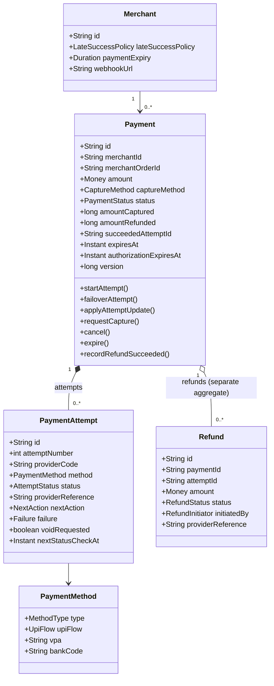
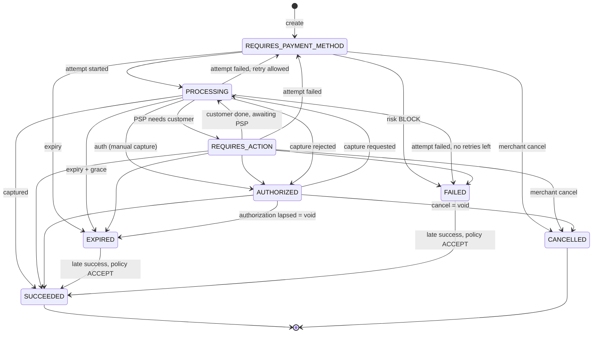
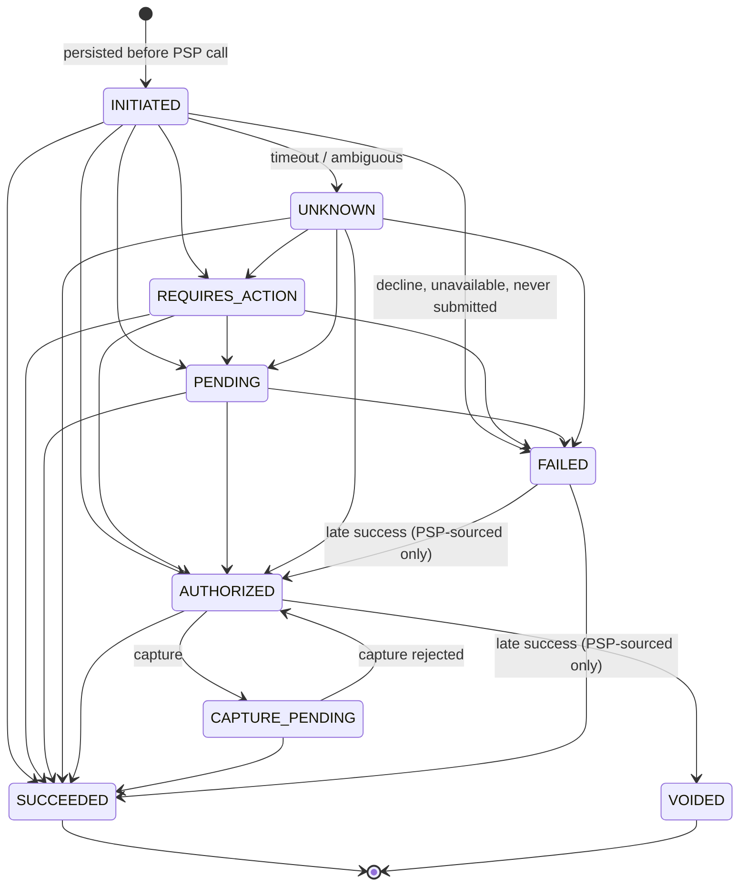
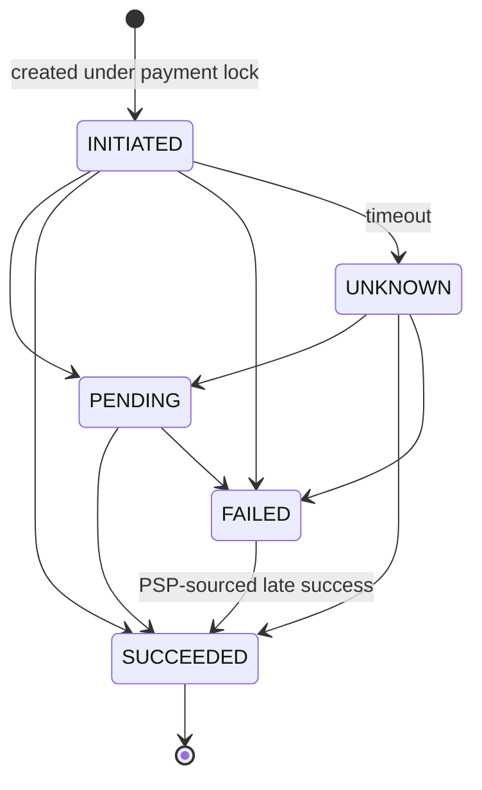
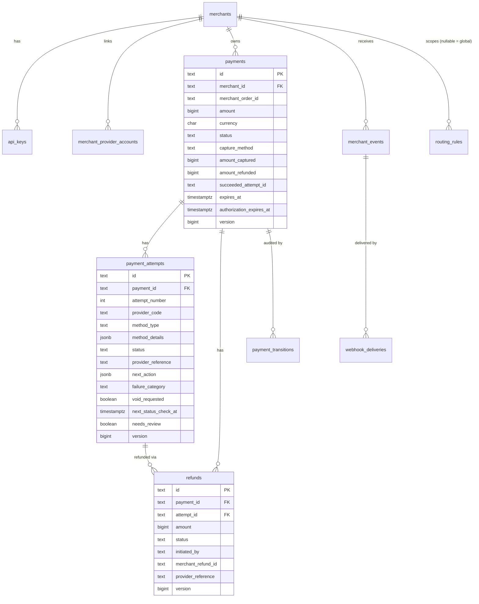

# Low-Level Design — Payment Gateway V1

| | |
|---|---|
| Phase | 4 — Low-level design |
| Status | Approved baseline (2026-09-26); updated as the implementation lands |
| Inputs | [requirements.md](requirements.md), [architecture.md](architecture.md) |

---

## 1. Code organization

A single Gradle module organized by **business module**, then by layer. Boundaries are enforced by ArchUnit tests (`ArchitectureTest`).

```
com.payments.gateway
├── shared         Money, Ids, ApiException/ErrorCode, crypto, JSON, request-id filter, error handler
├── merchant       Merchant, API keys, provider accounts, auth filters, admin API
├── idempotency    IdempotencyService + repository
├── provider
│   ├── spi        PaymentProvider SPI, capability + result model, exceptions   ← the only thing core code sees
│   ├── (root)     ProviderRegistry, ProviderClient (circuit breakers, metrics), ProviderHealthTracker
│   └── mock       Mock PSPs (MOCK_ALPHA, MOCK_BETA), in-memory PSP state, simulator endpoints
├── routing        RoutingEngine, rules (DB), strategies, admin API
├── risk           RiskEngine + rules
├── payment
│   ├── domain     Payment (aggregate root), PaymentAttempt, Refund, state enums, transitions — no Spring/JDBC
│   ├── application PaymentService, PaymentOutcomeService, RefundService, StatusResolver, ExpiryJob
│   ├── infrastructure JDBC repositories
│   ├── api        Request/response DTOs + mapper (the module's published language)
│   └── web        Controllers
└── webhook
    ├── inbound    PSP webhook receiver, inbox, retry job
    └── outbound   Merchant event recorder (outbox), delivery worker, signer, SSRF guard
```

**Dependency rules** (tested):
1. `..domain..` depends only on `shared` and the JDK.
2. Only a module's own `application` layer uses its `infrastructure`.
3. Core modules reach PSPs only through `provider.spi` and `ProviderClient`; nothing outside `provider.mock` imports it.
4. `webhook` never imports `payment.infrastructure` or `payment.domain` internals. It talks to the payment module through `PaymentOutcomeService` (inbound) and Spring events (outbound).

## 2. Domain model



- **Payment** is the merchant's intent: one per checkout or order. It is the aggregate root for its attempts; every mutation locks the payment row.
- **PaymentAttempt** is one try at one PSP with one method. It carries the PSP reference, the next action, and failure details.
- **Refund** is its own aggregate. It is created under the payment lock so the refundable-amount invariant holds under concurrency.
- **Money** is an integer amount in minor units (`long`) plus an ISO 4217 currency. Arithmetic is overflow-checked, and currency mismatches are rejected.

### Identifiers

| Prefix | Entity | Notes |
|---|---|---|
| `mer_` | Merchant | |
| `key_` | API key record | The secret itself is `sk_test_<43 chars base64url>`, shown once |
| `pay_` | Payment | |
| `att_` | Attempt | Sent to PSPs as the merchant reference / idempotency key |
| `rfnd_` | Refund | Sent to PSPs as the refund reference / idempotency key |
| `evt_` | Merchant event | |
| `whd_` | Webhook delivery | |
| `pwe_` | PSP webhook (inbox) record | |
| `rr_` | Routing rule | |
| `mpa_` | Merchant provider account | |

Format: `prefix_` + 26-character Crockford base32 ULID (48-bit millisecond timestamp + 80 random bits). Ids are globally unique, roughly time-ordered (index-friendly), and carry no merchant data.

Other identifiers: `merchant_order_id` (merchant's key, indexed, not unique — an order can have several payments), `provider_reference` (PSP id, unique per provider), `Idempotency-Key` (per merchant), `X-Request-Id` (per HTTP request, propagated to logs and traces).

## 3. State machines

### 3.1 Payment



The payment status is **derived from the active attempt** plus payment-level commands (cancel, expire):

| Active attempt status | Payment status |
|---|---|
| `INITIATED`, `PENDING`, `UNKNOWN`, `CAPTURE_PENDING` | `PROCESSING` |
| `REQUIRES_ACTION` | `REQUIRES_ACTION` |
| `AUTHORIZED` | `AUTHORIZED` (manual capture) — with automatic capture the platform captures and the payment shows `PROCESSING` |
| `SUCCEEDED` | `SUCCEEDED` |
| `FAILED` | `REQUIRES_PAYMENT_METHOD` if attempts < max (default 5) and not expired, otherwise `FAILED` |
| `VOIDED` | `CANCELLED` or `EXPIRED` (whichever command caused the void) |

Refunds and disputes are **not** payment states. The payment exposes `amount_refunded`, and refunds have their own lifecycle (see 3.3).

**Cancel** is allowed from `REQUIRES_PAYMENT_METHOD`, `REQUIRES_ACTION`, and `AUTHORIZED` (void). It is rejected in `PROCESSING` because money may be moving; such payments resolve or expire instead.

### 3.2 Attempt



Rules applied by `PaymentAttempt.transition(...)`:
- **Same state → no-op** (duplicate webhook or repeated status check).
- **Stale update → no-op.** For example `PENDING` arriving after `SUCCEEDED`. Transitions are monotonic by rank.
- **Contradiction → conflict, not applied.** For example the PSP says `FAILED` after `SUCCEEDED`. The event is logged, counted in a metric, and left for reconciliation.
- `FAILED → SUCCEEDED/AUTHORIZED` is accepted **only** from PSP-sourced evidence (`PROVIDER_WEBHOOK`, `STATUS_CHECK`, `RECONCILIATION`), never from an API call.
- A reported success whose amount or currency differs from the attempt is **not applied** (flagged `amount_mismatch`).

**Late and duplicate success** (attempt reaches `SUCCEEDED` while the payment cannot take it):

| Payment state | Result |
|---|---|
| Active (not terminal) | Payment → `SUCCEEDED`, `succeeded_attempt_id` set |
| `SUCCEEDED` by another attempt | Duplicate → system refund of the extra attempt (`SYSTEM_DUPLICATE_SUCCESS`) |
| `EXPIRED` / `FAILED`, policy `ACCEPT` | Payment → `SUCCEEDED` (late) |
| `EXPIRED` / `FAILED`, policy `AUTO_REFUND` | Payment stays terminal → system refund (`SYSTEM_LATE_SUCCESS`) |
| `CANCELLED` | Always a system refund (the merchant explicitly declined) |

A late or duplicate **authorization** (no money has moved yet) is always voided, whatever the policy.

### 3.3 Refund



Invariant (per attempt): `Σ amount(refunds where status ≠ FAILED) ≤ attempt amount` for succeeded attempts. `payments.amount_refunded` counts `SUCCEEDED` refunds of the winning attempt only, and a database `CHECK (amount_refunded <= amount_captured)` backs it up.

### 3.4 Merchant webhook delivery

`PENDING → SUCCEEDED` on a 2xx response. On failure it stays `PENDING` and is rescheduled with backoff; after the last attempt it becomes `DEAD`. `DEAD → PENDING` happens through replay.

## 4. Transaction boundaries and algorithms

### 4.1 Confirm

```text
confirm(merchant, paymentId, method, client):
  tx1:
    p = repo.lockPayment(paymentId)               -- SELECT … FOR UPDATE, loads attempts
    require p.status == REQUIRES_PAYMENT_METHOD and now < p.expiresAt
    risk = riskEngine.evaluate(ctx)
    if risk == BLOCK: p.markRiskBlocked(); save; return p
    decision = routing.route(ctx)                 -- ordered candidates; empty → 422/503
    a = p.startAttempt(newId("att"), method, decision.first)   -- attempt INITIATED, payment PROCESSING
    save(p)                                       -- commit: write-ahead record exists before any PSP call
  loop over candidates:
    try:
      result = providerClient.initiate(provider, request(ref = a.id))
      tx2: lock p; p.applyAttemptUpdate(a.id, result, PROVIDER_RESPONSE); save; break
    catch ProviderUnavailable:                    -- definitely not processed
      tx: lock p; a = p.failoverAttempt(a.id, PROVIDER_UNAVAILABLE, next candidate) (or fail when none left); save
    catch ProviderTimeout:                        -- maybe processed
      tx: lock p; attempt → UNKNOWN; schedule status check; save; break
  after commit: auto-capture if the attempt is AUTHORIZED and capture_method = AUTOMATIC
  return p
```

`save(p)` writes the payment (`UPDATE … WHERE id=? AND version=?`), inserts new attempts, updates changed ones (version-checked), appends `payment_transitions`, and publishes merchant events into the outbox tables — all in the same transaction.

### 4.2 Applying PSP outcomes (webhook, status check, reconciliation)

`PaymentOutcomeService.applyProviderUpdate(providerCode, providerReference | attemptId, update, source)`:
1. Resolve the attempt → payment id (by `(provider_code, provider_reference)` or by attempt id).
2. tx: lock the payment; `applyAttemptUpdate`; handle the result flags:
   - `refundRequired` → create a system refund (in the same tx; executed after commit).
   - `captureRequired` → mark the attempt `CAPTURE_PENDING` and schedule it (executed after commit).
   - `amountMismatch` or `conflict` → metric + warning log with ids; the attempt is flagged `needs_review`.
3. After commit: record the final outcome in `ProviderHealthTracker` and run any follow-up PSP call.

### 4.3 Refund creation

```text
tx1: p = lockPayment; require status SUCCEEDED (or a system refund for a specific succeeded attempt)
     refundable = attempt.amount − Σ non-failed refunds(attempt)
     require 0 < amount ≤ refundable            -- else 422 amount_exceeds_refundable
     insert refund INITIATED; commit
call provider.refund(ref = refund.id)          -- outside tx
tx2: lock p; refund.transition(result); if SUCCEEDED: p.recordRefundSucceeded(); save
```

## 5. Provider SPI

```java
public interface PaymentProvider {
    String code();
    ProviderCapabilities capabilities();
    ProviderPaymentResult initiatePayment(InitiatePaymentRequest request);   // may throw ProviderUnavailableException / ProviderTimeoutException
    ProviderPaymentResult fetchPaymentStatus(PaymentStatusQuery query);      // NOT_FOUND if the PSP never saw the reference
    ProviderPaymentResult capture(CaptureRequest request);
    ProviderPaymentResult voidAuthorization(VoidRequest request);
    ProviderRefundResult refund(RefundRequest request);
    ProviderRefundResult fetchRefundStatus(RefundStatusQuery query);
    List<ProviderEvent> parseWebhook(InboundWebhook webhook);                // verifies signature; throws WebhookVerificationException
}
```

**Capabilities** (used by routing and the orchestrator): supported method types and UPI flows, currencies, per-method amount limits, `manualCapture`, `voidSupported`, `partialRefunds`, `statusQuery`. The orchestrator checks a capability before invoking an optional operation.

**Normalized outcomes:** `ProviderPaymentOutcome = REQUIRES_ACTION | PENDING | AUTHORIZED | SUCCEEDED | FAILED | VOIDED | NOT_FOUND`; `ProviderRefundOutcome = PENDING | SUCCEEDED | FAILED | NOT_FOUND`. Each result carries `providerReference`, `nextAction`, `failure (code, message, category)`, and the raw PSP status.

**Failure classification** decides retry and failover:

| Signal | Adapter maps to | Orchestrator action |
|---|---|---|
| Connect refused, DNS failure, circuit open | `ProviderUnavailableException` | Fail over to next candidate |
| Read timeout, connection reset after send, ambiguous 5xx | `ProviderTimeoutException` | Attempt `UNKNOWN`; resolver |
| Business decline | `FAILED` result, category `ISSUER` / `CUSTOMER` | Payment back to `REQUIRES_PAYMENT_METHOD` |
| Invalid request / auth error at PSP | `FAILED` result, category `VALIDATION` / `PROVIDER` | Same, plus alert |

`FailureCategory = CUSTOMER | ISSUER | PROVIDER | PROVIDER_UNAVAILABLE | VALIDATION | RISK | TIMEOUT | NOT_SUBMITTED`. Only `PROVIDER`, `PROVIDER_UNAVAILABLE`, and `TIMEOUT` count against a provider's routing success rate.

`ProviderClient` wraps every call with a Resilience4j circuit breaker per provider (count window 20, minimum 10 calls, 50% failure threshold, 30 s open, 3 half-open probes). Only technical failures count. It also records a latency timer `pg_provider_call_seconds{provider,operation,result}`.

### Mock providers (Phase 8)

`MOCK_ALPHA` supports UPI (intent, QR, collect), cards, and netbanking. `MOCK_BETA` supports UPI and cards. Both support manual capture, void, and partial refunds. PSP state is in memory (`MockPsp`), keyed by provider reference and by merchant reference (attempt id).

Deterministic scenarios by **amount paise suffix** (like PSP test cards):

| Suffix | Scenario |
|---|---|
| `…01` | Timeout on initiate, but the PSP processed it → status check returns `SUCCEEDED` (or `AUTHORIZED` for manual capture) |
| `…03` | Declined (`FAILED`, category `ISSUER`) |
| `…04` | `PENDING`; completes silently (no webhook) → found by status check |
| `…05` | Timeout on initiate, never processed → status check `NOT_FOUND` → attempt `FAILED (NOT_SUBMITTED)` |
| other | Card, netbanking, UPI intent/QR → `REQUIRES_ACTION` (redirect / intent URI / QR); UPI collect → `PENDING`. Completed through the simulator, which sends a signed webhook |

Refund amount suffix: `…07` pending (resolved by status check), `…08` timeout but processed, `…09` failed, otherwise immediate success.

Simulator endpoints (only when `pg.providers.mock.enabled=true`):
- `GET /simulator/{provider}/checkout/{providerReference}` — HTML "PSP hosted page" with Pay / Fail buttons.
- `POST /simulator/{provider}/payments/{providerReference}/complete` `{"outcome":"success|failure","duplicate_webhook":false}` — completes and sends the webhook(s).
- `POST /simulator/{provider}/availability` `{"available":false}` — simulates a PSP outage (tests failover).

## 6. Routing engine

```text
route(ctx):
  candidates = merchant-linked providers
             ∩ capability match (method, UPI flow, currency, amount range, manual capture)
             − providers whose circuit is OPEN − ctx.excluded
  for rule in merchantRules(priority asc) ++ globalRules(priority asc):
      if rule.enabled and all(rule.conditions match ctx):
          ordered = strategy(rule, targets ∩ candidates)
          if ordered non-empty:
              if rule.allowFallback: ordered += (candidates − ordered) by health score
              return decision(ordered, rule.id)
  return decision(DYNAMIC(candidates), rule = null)
```

Rule document (`routing_rules` row):

```json
{
  "name": "UPI high value to Alpha",
  "merchant_id": null,
  "priority": 10,
  "conditions": [
    {"field": "method", "op": "eq", "value": "upi"},
    {"field": "amount", "op": "gte", "value": 500000}
  ],
  "strategy": "WEIGHTED",
  "targets": [{"provider": "MOCK_ALPHA", "weight": 80}, {"provider": "MOCK_BETA", "weight": 20}],
  "allow_fallback": true
}
```

Fields: `method`, `upi_flow`, `bank_code`, `amount`, `currency`, `capture_method`. Operators: `eq`, `neq`, `in`, `not_in`, `gt`, `gte`, `lt`, `lte`.

Strategies:
- `PRIORITY` keeps the target order.
- `WEIGHTED` picks the first by weighted random, then orders the rest by weight.
- `DYNAMIC` orders by health score: `score = attributableSuccessRate − 0.1 · min(1, ewmaLatencyMs / 5000)`. A provider with fewer than 20 samples gets a prior success rate of 0.95. The window is the last 100 final outcomes per provider and method.

Rules are cached per instance, refreshed every 30 s, and invalidated immediately on admin writes. Health is per instance (see [ADR-011](decisions/ADR-011-no-redis-v1.md)).

## 7. Risk engine

`RiskEngine.evaluate(RiskContext) → RiskDecision(outcome, reasons)`. The rules are Spring beans implementing `RiskRule`. The most severe outcome wins: `BLOCK > CHALLENGE > REVIEW > ALLOW`.

| Rule | Logic (config under `pg.risk`) |
|---|---|
| `AmountLimitRule` | `> review-threshold` (₹2,00,000) → `REVIEW`; `> block-threshold` (₹10,00,000) → `BLOCK` |
| `BlocklistRule` | VPA, IP, email, customer reference in the configured blocklists → `BLOCK` |
| `VelocityRule` | More than `max-attempts-per-customer` (10) attempts by the same customer reference in `velocity-window` (10 min) → `BLOCK` |

External providers (e.g. a fraud API) implement `RiskRule` and run with their own timeout; a timeout is treated as `REVIEW` (fail-open for availability, flagged for review).

## 8. Idempotency

Table `idempotency_records (merchant_id, idempotency_key) PK`, `request_hash`, `status IN_PROGRESS|COMPLETED`, `response_status`, `response_body`, `locked_until`, `expires_at`.

```text
run(merchant, key, fingerprint, action):
  INSERT … ON CONFLICT DO NOTHING (IN_PROGRESS, locked_until = now + 30s)     -- autocommit
  if inserted → execute
  else existing = SELECT
       existing.hash ≠ fingerprint            → 422 idempotency_key_reuse
       COMPLETED                              → replay stored status + body (Idempotent-Replayed: true)
       IN_PROGRESS and locked_until > now     → 409 idempotency_request_in_progress (Retry-After: 1)
       IN_PROGRESS and lease expired          → conditional UPDATE takeover → execute
  execute:
    2xx result or 4xx business ApiException → store and mark COMPLETED
    anything else (5xx, unexpected)         → DELETE record so a retry re-executes
```

- **Fingerprint:** SHA-256 over `METHOD path \n canonical JSON(request DTO)`. Canonicalization makes semantically equal bodies match regardless of whitespace or key order.
- Re-execution is safe because operations are idempotent at the domain level too. A repeated confirm finds the existing attempt, and PSP calls reuse `att_…` / `rfnd_…` as PSP-side idempotency keys.
- Retention is 7 days (`pg.idempotency.ttl`); a worker purges expired rows in batches.
- Webhooks use their own dedupe: `UNIQUE(provider_code, provider_event_id)` on the inbox, plus idempotent transitions.

## 9. Webhooks

### 9.1 Inbound (PSP → gateway)
`POST /v1/webhooks/providers/{code}` works as follows:
1. The adapter's `parseWebhook` verifies the signature (the mock uses `X-Mock-Signature: t=…,v1=HMAC-SHA256(secret, t + "." + body)` with a 5 min tolerance).
2. Insert into `provider_webhook_events` (`ON CONFLICT DO NOTHING`).
3. Process inline.
4. Respond `200`, or `401` if the signature is invalid.

Failed processing stays `RECEIVED` with `next_attempt_at`, and `InboxRetryJob` retries it with backoff (max 10). The request body is capped at 256 KB.

### 9.2 Outbound (gateway → merchant)
- `MerchantEventRecorder` listens to `MerchantEventRequested` **inside** the state-change transaction and inserts `merchant_events` + `webhook_deliveries`. This is the transactional outbox.
- `WebhookDeliveryWorker` claims due deliveries (`FOR UPDATE SKIP LOCKED`, lease 60 s), validates the URL (SSRF), POSTs with a 2 s connect / 5 s read timeout, and records the result.
- Headers: `PG-Event-Id`, `PG-Event-Type`, `PG-Signature: t=<unix>,v1=<hex>`.
- Body: `{"id":"evt_…","type":"payment.succeeded","created_at":"…","data":{"object":{…payment resource…}}}`.
- Retry schedule: 30 s, 2 m, 10 m, 30 m, 1 h, 3 h, 6 h, 12 h, 24 h (±20% jitter), which is 10 attempts over ≈ 47 h, then `DEAD`. `POST /admin/v1/webhook-deliveries/{id}/replay` re-queues it.

## 10. Workers

All workers use the **claim-with-lease** pattern, so they are safe with N replicas:

```sql
UPDATE payment_attempts SET next_status_check_at = :leaseUntil
 WHERE id IN (SELECT id FROM payment_attempts
               WHERE next_status_check_at <= :now
               ORDER BY next_status_check_at
               LIMIT :batch
               FOR UPDATE SKIP LOCKED)
RETURNING id, payment_id, provider_code, status, …;
```

| Job | Interval | Work |
|---|---|---|
| `StatusResolver` (attempts) | 1 s | For `INITIATED` older than 30 s, `UNKNOWN`, `PENDING`, `REQUIRES_ACTION`, `CAPTURE_PENDING`: fetch status and apply. `NOT_FOUND` on `INITIATED`/`UNKNOWN` → `FAILED (NOT_SUBMITTED)`. `AUTHORIZED` with `void_requested`: void. `CAPTURE_PENDING` still authorized at the PSP: re-issue capture |
| `StatusResolver` (refunds) | 1 s | `INITIATED` (stale), `UNKNOWN`, `PENDING`: fetch refund status, or re-submit if `NOT_FOUND` |
| `ExpiryJob` | 5 s | Expire due payments (see FR-P7); for an authorized payment set `void_requested` |
| `InboxRetryJob` | 5 s | Reprocess `RECEIVED` PSP webhooks |
| `WebhookDeliveryWorker` | 1 s | Deliver merchant webhooks |
| `IdempotencyPurgeJob` | 1 h | Delete expired idempotency records |

Status-check backoff: 5 s, 10 s, 30 s, 1 m, 2 m, 5 m, 10 m, 30 m, 1 h, then every 2 h. After 72 h from creation the item is set `needs_review = true`, polling stops, and an alert metric fires.

## 11. Database schema

Migrations: [src/main/resources/db/migration](../src/main/resources/db/migration). Conventions: `text` ids, `bigint` minor-unit amounts with `CHECK > 0`, `timestamptz` everywhere (UTC), `jsonb` only for open-ended data (metadata, method details, next action, rule definitions), and a `version` column on mutable aggregates.



Key constraints and indexes:

| Table | Constraint / index | Purpose |
|---|---|---|
| `payments` | `CHECK amount_refunded <= amount_captured <= amount` | Money invariants in the DB |
| `payments` | `(merchant_id, created_at DESC)`, `(merchant_id, merchant_order_id)` | Merchant queries |
| `payments` | Partial `(expires_at)` for active statuses; `(authorization_expires_at)` for `AUTHORIZED` | Expiry job |
| `payment_attempts` | `UNIQUE (payment_id, attempt_number)` | Ordering, no duplicate attempts |
| `payment_attempts` | Partial `UNIQUE (provider_code, provider_reference)` | Webhook lookup; one PSP txn per attempt |
| `payment_attempts` | Partial `(next_status_check_at)` | Resolver claims |
| `refunds` | Partial `UNIQUE (merchant_id, merchant_refund_id)` | Merchant-level refund idempotency |
| `idempotency_records` | `PK (merchant_id, idempotency_key)`, `(expires_at)` | Dedupe + purge |
| `provider_webhook_events` | `UNIQUE (provider_code, provider_event_id)` | Inbound dedupe |
| `webhook_deliveries` | Partial `(next_attempt_at) WHERE status='PENDING'` | Delivery claims |
| `payment_transitions`, `audit_log` | Triggers reject `UPDATE`/`DELETE` | Immutability |
| `merchant_events` | `payload` is `text`, not `jsonb` | `jsonb` reorders keys; deliveries must be byte-identical to what was signed |

**Isolation:** `READ COMMITTED` plus explicit `SELECT … FOR UPDATE` on the payment row serializes writers per payment; version checks are a second safety net. No `SERIALIZABLE` needed, because every invariant is checked under the row lock.

**Retention:** `payments`, `payment_attempts`, `refunds`, `payment_transitions`, `audit_log` ≥ 8 years (archived to cold partitions / S3 in `ap-south-1` after 13 months); `provider_webhook_events` 180 days; `merchant_events` / `webhook_deliveries` 90 days; `idempotency_records` 7 days.

## 12. REST API (V1)

Base path `/v1`. JSON uses snake_case; amounts are integers in minor units; timestamps are ISO-8601 UTC. Every mutating `POST` requires `Idempotency-Key`. Authentication is `Authorization: Bearer sk_test_…`.

| Method & path | Purpose | Success |
|---|---|---|
| `POST /v1/payments` | Create payment | `201` payment |
| `GET /v1/payments/{id}` | Retrieve | `200` payment |
| `POST /v1/payments/{id}/confirm` | Attach method, start attempt | `200` payment (+ `next_action`) |
| `POST /v1/payments/{id}/capture` | Capture an authorized payment | `200` payment |
| `POST /v1/payments/{id}/cancel` | Cancel / void | `200` payment |
| `POST /v1/payments/{id}/refunds` | Create refund | `201` refund |
| `GET /v1/payments/{id}/refunds` | List refunds of a payment | `200` list |
| `GET /v1/refunds/{id}` | Retrieve refund | `200` refund |
| `POST /v1/webhooks/providers/{code}` | PSP webhooks (signature-authenticated) | `200` |
| `POST /admin/v1/merchants` | Create merchant (+ webhook secret, shown once) | `201` |
| `POST /admin/v1/merchants/{id}/api-keys` | Issue an API key (shown once) | `201` |
| `GET/POST/PUT /admin/v1/routing-rules` | Manage routing rules | `200/201` |
| `GET /admin/v1/providers/health` | Circuit states + scores | `200` |
| `POST /admin/v1/webhook-deliveries/{id}/replay` | Re-queue a delivery | `202` |
| `GET /admin/v1/webhook-deliveries?resource_id=` | Delivery status for a payment or refund | `200` |

Example — create and confirm UPI intent:

```http
POST /v1/payments
Authorization: Bearer sk_test_…
Idempotency-Key: 5f1c2a2e-order-1001

{"amount": 49900, "currency": "INR", "merchant_order_id": "order_1001",
 "customer": {"reference": "cust_42", "email": "a@example.com"}}
```

```http
POST /v1/payments/pay_01K…/confirm
Idempotency-Key: 5f1c2a2e-order-1001-confirm

{"payment_method": {"type": "upi", "upi": {"flow": "intent"}},
 "client": {"ip": "203.0.113.7", "user_agent": "Mozilla/5.0"}}
```

```json
{
  "id": "pay_01K…",
  "status": "requires_action",
  "amount": 49900,
  "currency": "INR",
  "merchant_order_id": "order_1001",
  "capture_method": "automatic",
  "amount_captured": 0,
  "amount_refunded": 0,
  "next_action": {"type": "upi_intent", "upi_uri": "upi://pay?pa=mock@alpha&pn=Mock&tr=att_01K…&am=499.00&cu=INR"},
  "latest_attempt": {"id": "att_01K…", "status": "requires_action", "method": "upi", "provider": "MOCK_ALPHA",
                     "provider_reference": "mock_alpha_…"},
  "attempt_count": 1,
  "expires_at": "2026-09-26T10:15:00Z",
  "created_at": "2026-09-26T10:00:00Z",
  "updated_at": "2026-09-26T10:00:01Z",
  "version": 3
}
```

**Error model** — RFC 9457 `application/problem+json`:

```json
{"title": "Payment is not in a valid state for this operation", "status": 409,
 "detail": "Cannot confirm a payment in status SUCCEEDED",
 "code": "payment_invalid_state", "request_id": "req_…"}
```

| Code | HTTP | Retry? |
|---|---|---|
| `validation_error` | 400 | No — fix the request (`errors[]` lists fields) |
| `idempotency_key_required` | 400 | No |
| `authentication_required` / `invalid_api_key` | 401 | No |
| `resource_not_found` | 404 | No |
| `payment_invalid_state` | 409 | No (re-read the payment) |
| `idempotency_request_in_progress` | 409 | Yes, same key, after `Retry-After` |
| `idempotency_key_reuse` | 422 | No — use a new key |
| `amount_exceeds_refundable` | 422 | No |
| `capture_amount_mismatch` | 422 | No |
| `unsupported_payment_method` | 422 | No |
| `no_provider_available` | 503 | Yes, with backoff |
| `internal_error` | 500 | Yes, same key |

## 13. Configuration reference (`pg.*`)

| Property | Default | Meaning |
|---|---|---|
| `pg.payments.default-expiry` | `15m` | Payment expiry if the merchant has no override |
| `pg.payments.processing-grace` | `30m` | Extra time before expiring a `PROCESSING` payment |
| `pg.payments.authorization-ttl` | `5d` | Uncaptured authorization lifetime |
| `pg.payments.max-attempts` | `5` | Attempts per payment |
| `pg.idempotency.ttl` / `.lease` | `7d` / `30s` | Idempotency retention / in-progress lease |
| `pg.workers.enabled` | `true` | Worker role on/off |
| `pg.webhooks.outbound.allow-private-targets` | `false` | Only `true` for local/test |
| `pg.security.admin-tokens` | — (required) | Admin bearer tokens |
| `pg.security.data-encryption-key` | — (required) | Base64 AES-256 key for secrets at rest (from KMS/Secrets Manager in AWS) |
| `pg.providers.mock.enabled` | `false` | Enables mock PSPs + simulator (local/test only) |
| `pg.risk.*` | see §7 | Risk thresholds and lists |

## 14. Observability details

- **MDC keys:** `request_id`, `merchant_id`, `payment_id`, `attempt_id`, `provider`.
- **Metrics (Micrometer):** `pg.payments.created`, `pg.payment.attempts{provider,method,outcome}`, `pg.provider.call{provider,operation,result}` (timer), `pg.webhooks.inbound{provider,result}`, `pg.webhook.deliveries{result}`, `pg.merchant.events{type}`, `pg.status.checks{outcome}`, `pg.payments.late_success{action}`, `pg.provider.conflicts{source}`, `pg.provider.amount_mismatches{source}`.
- **Log hygiene:** request and response bodies are never logged, and neither are PII values (VPA, email, phone). Risk decisions log reason codes such as `vpa_blocklisted`, never the value. API keys are never logged (only `key_…` ids).

## 15. Test matrix

| Level | What | Where |
|---|---|---|
| Unit | Payment/attempt/refund transitions, late and duplicate success, money arithmetic, ids | `payment.domain`, `shared` |
| Unit | Routing: capability filter, rule matching, strategies, circuit exclusion | `routing` |
| Unit | Webhook signing and verification, SSRF guard | `webhook` |
| Integration (embedded PostgreSQL) | End-to-end flows over HTTP: UPI intent via simulator webhook, card manual capture, cancel/void, timeout → resolver, never-submitted, failover on outage, duplicate webhooks, idempotency replay/conflict/reuse, refunds (partial, multiple, over-refund, concurrent), late success auto-refund, merchant webhook delivery and retry, auth failures | `*IntegrationTest` |
| Architecture | Module and layer dependency rules | `ArchitectureTest` |
| Contract (Phase 10) | Adapter ↔ PSP sandbox recorded fixtures | `provider.*` |
| Load (Phase 17) | k6: steady 100 TPS, peak 1,000 TPS, spike ×5 | `load/` |
